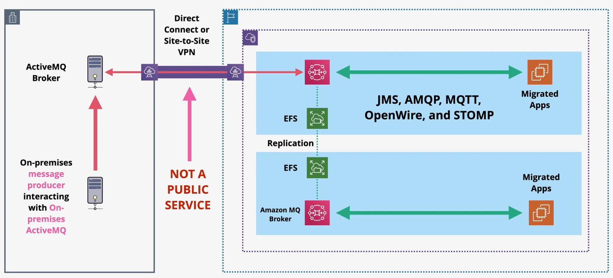

# Amazon MQ

SNS and SQS are public AWS services using AWS APIs. SNS provides topics and SQS provides queues. Both SQS and SNS are highly available by default.

Many organizations already using existing topics and queues. They want to migrate these topics and queues to AWS without major refactoring efforts.

Amazon MQ is an open-source message broker based on `Apache ActiveMQ` that provides queues and topics.

Amazon MQ supports `JMS` APIs or protocols such as `AMQP`, `MQTT`, `OpenWire`, and `STOMP`.

Customers can choose between a single instance or a pair of instances (active/standby) for high availability. All instances are VPC-based and accessed over private networking.

Amazon MQ does not have have the same integration with other AWS services as SQS or SNS.

> [Exam Tip]
>
> Amazon MQ is not a public service. You must have private networking to access Amazon MQ queues or topics.