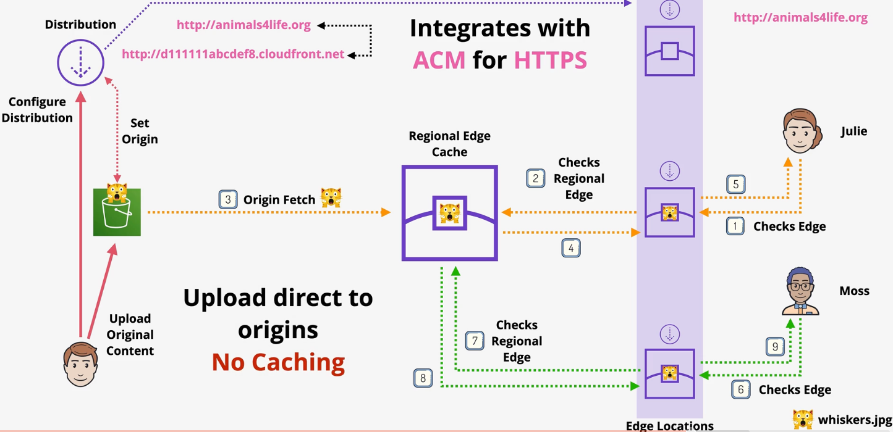
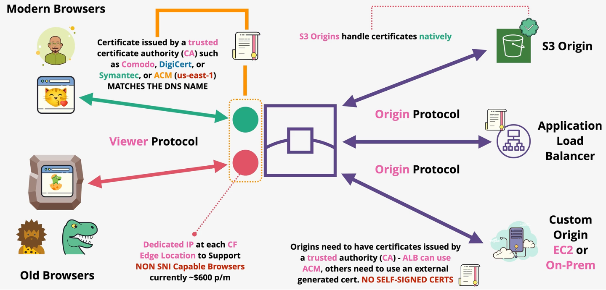
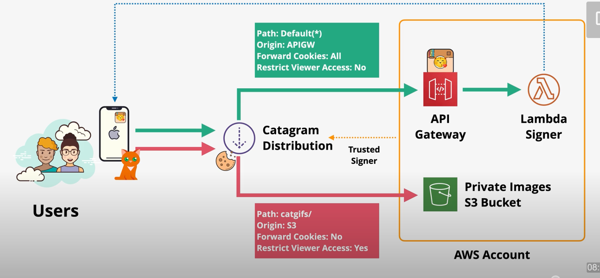
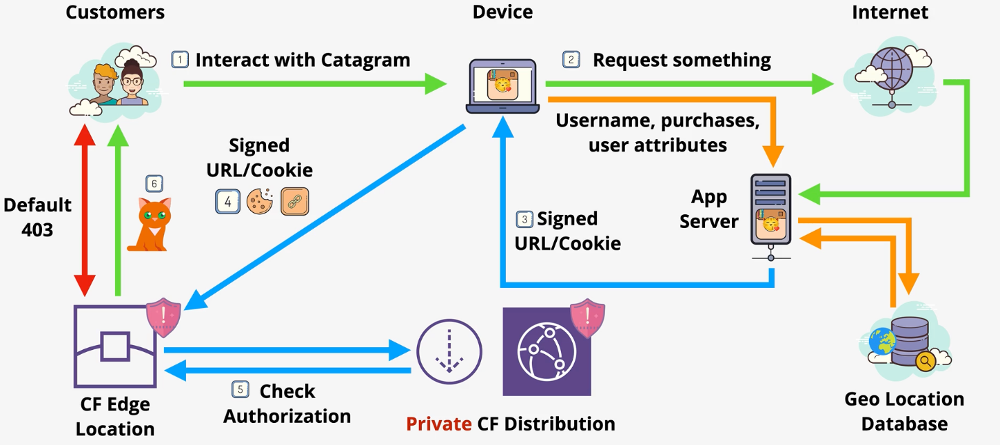

# CloudFront

CloudFront is a `Content Delivery Network` (CDN) that distributes static resources from edge locations around the world. CloudFront reduces impact on backend services and serves content faster to global locations for `better user experience`.

`Edge locations` are the global points-of-presense (POP) around the globe in which your data is cached locally. Edge locations are responsible for serving content to users. A `regional edge cache` is a larger version of an edge location that provides another layer of caching.

1. When a user makes a request, it is routed to the closest `edge location`. If that edge location has the requested data cached locally, it is served to the user.
2. **Custom Origin** - If the edge location does not have the data cached locally, a request is made to the closest `regional edge cache` (custom origins only). If the data is cached on the regional edge, it is returned to the edge location, cached, and served to the user.
2. **S3 Origin** - CloudFront distributions using an S3 origin do not use regional edge locations.
3. If the regional edge location does not contain the data, it is fetched from the `origin`. The resulting data is cached on the regional edge cache and edge location, then served to the user.

CloudFront caches read requests only. It does not support **write caching**.

CloudFront integrates with ACM to enable **custom domains**.

## Distributions

You create a CloudFront **distribution** to tell CloudFront where you want content to be delivered from, and the details about how to track and manage content delivery.

The following settings exist on the distribution:

**Price Class**: CloudFront allows you to customize the regions in which you're distribution will be available. Lower prices classes resule in lower costs.
- All edge locations (best performance)
- Only use North America and Europe
- Use North America, Europe, Asia, Middle East, and Africa

**WAF**: If applying a web ACL, it is done on the distribution.

**Alternate Domain Name**: Specifying an alternate domain name allows customers to distribute content from a custom domain. A distribution supports zero or more alternate domain names.

If no alternate domain names are configured, users must access the content from the *cloudfront.net* domain name.

When configuing an alternate domain name, users must also supply an ACM certificate (in the us-east-1 region) to enable TLS.

**Supported HTTP Version**: Customers can choose between *HTTP/2* and *HTTP/3*.

**Default Root Object**: When a user calls the root domain name without a path, customers can specify which object should be returned.

**Logging**: Customers can configure whether viewer logs are exported to an S3 bucket. This configuration supports full distribution logging or based on a prefix.

**IPv6**: Customers can choose whether IPv6 is supported by the distribution.

## Behaviors

A **cache behavior** is an configuration object that defines how CloudFront processes requests.

A CloudFront distribution consists of one or more cache behaviors.

A cache behavior is assigned a **precedence**, which determines the order in which cache behaviors should be evaluated.

The following settings can be configured on a cache behavior:

**Path pattern**: The path pattern determines which requests apply to this cache behavior, based on the request’s URI path.

**Origin and Origin Groups**: Defines the origin that is associated with this behavior.

**Compress Objects Automatically**: CloudFront can automatically compress certain files that it receives from the origin before delivering them to the viewer.

**Viewer Protocol Policy**: Defines the protocol policy that should be applied for viewers (end-users).
- HTTP and HTTPS
- Redirect HTTP to HTTPS
- HTTPS only

**Allowed HTTP Methods**: Restricts which HTTP methods can be used for this behavior.
- GET, HEAD
- GET, HEAD, OPTIONS
- GET, HEAD, OPTIONS, PUT, POST, PATCH, DELETE

**Restrict Viewer Access**: If you restrict viewer access, viewers must use CloudFront signed URLs or signed cookies to access your content.

**Cache configurations**: Settings related to how data should be cached; The appropriate values to be set on response headers.

## TTL and Invalidations

When a viewer makes a request to CloudFront, CloudFront will first check the edge location for any local copies of the object. If the object is in the cache, but expired, it will forward a request to the origin.

If the data has not changed since it was cached, the origin will return a `304 NOT MODIFIED` response. If the data has changed, it will return the new content with a `200 OK` response.

The default TTL on a behavior is **24 hours**.

S3 and custom origins can direct CloudFront to use object-specific TTL settings using HTTP headers. When using S3, the headers are specified in object metadata.
- `Cache-Control max-age` (seconds)
- `Cache-Control s-maxage` (seconds).
- `expires` (date & time)

Engineers can set a *minimum TTL* and *maximum TTL*. These settings limit per-object TTL settings (e.g., if the origin specifies a TTL value lower than the minimum TTL, the minimum TTL is used instead).

**Cache invalidation** can be performed on all edge locations within a distribution. When performing a cache invalidation, engineers specify a path (e.g., *, /images/*). Cache invalidations will result in a cost.

To reduce the impact of unwanted caching, consider using *versioned file names* (e.g., catpic_v1.png, catpic.v2.png).

## CloudFront and SSL

Each CloudFront distribution is automatically assigned a cloudfront.net domain name (e.g., https://abcdef.cloudfront.net/).

SSL is supported by default with the *.cloudfront.net certificate.

Optionally, engineers can specify an **alternate domain name** (CNAME) (e.g., cdn.mydomain.com). When using an alternate domain name, you **must** add an ACM certificate (us-east-1), even if you choose not to support HTTPS.

CloudFront supports three protocol settings:
- HTTP and HTTPS
- Redirect HTTP to HTTPS
- HTTPS only

There are two SSL connections that occur during a CloudFront request. Both of these connections require **public certificates**.
1. Viewer to CloudFront
2. CloudFront to Origin

## SNI

Imagine a server that hosts multiple applications using different domain names and TLS certificates (e.g., *example-1.com, example-2.com*).

Requests that come to this server contain a *layer 7* `HOST` header that determines the destination application for this request.

When an SSL request is made to this server, the encrypted connection happens at layer 4. Since this is before layer 7 processing, the server does not yet know which application this request is destined for. Because of this, it does not know which domain name or certificate to use.

Historically, this has limited a server to only supporting a single TLS certificate.

**SNI** (Server Name Identification) is a TLS extension that allows the host identifier to be included in layer 4 processing so the server knows which certificate should be using for encryption. The result is that a server can now support multiple TLS certificates.

Note: Older browsers may not support SNI.

## Origins

A CloudFront `origin` is the source location of your content. 

CloudFront supports several origin types:
- S3
- ELB
- Mediastore
- Mediapackage
- Custom

## Caching and Optimization

By default, **no query paramters are forwarded** to the origin and **no query parameters are cached**.

`/sock.jpg?color=blue&size=large`

The CloudFront distribution will not send the `color` or `size` parameters to the origin. The origin will only receive a request for `sock.jpg`.

This may cause issues when parameters are important in determining which content is served to the user.

CloudFront can be configured to **forward and cache all parameters**.

`/sock.jpg?color=blue&size=large`

Both the `color` and `size` parameters are forwarded to the origin and cached at the edge location.

CloudFormation also supports configuration to forward and caching specific parameters.

`/sock.jpg?color=blue&size=large`

With this configuration, the `color` may be forwarded and cached, but `size` would not.

## Private Distributions

Distributions can be **public**, in which all objects are open for public access. Distributions can also be **private**, in which all requests require a signed cookie or URL.

Distributions support multiple cache behaivors, some of which may be public and others private.

A `CloudFront key` is created by an account root user for the account (not a specific user). Once the key exists within the account, the account can be added as a `trusted signer`.

Users can access private content from a CloudFront distribution using:
- `Signed URLs` provide access to a single object and should be used when the client doesn't support cookies.
- `Signed cookies` provide access to groups of objects (e.g., groups of files or all types of one file).

## Geo Restrictions

CloudFront supports the ability to limit requests from specific geographies. This can be done by using the native CloudFront geo restriction feature, or by integrating with a 3rd-party geolocation service.

The `CloudFront geo restriction` feature only supports **whitelisting or blacklisting countries**. No other types of geography is supported (e.g., continent, city, state). This setting is done on the entire distribution.

The CloudFront geo restriction feature is 99.8% accurate.

Alternatively, `3rd-party geolocation integrations` are completely customizable.

> [Exam Tip]
>
> Using a 3rd-party geo restriction architecture enables the ability to control access based on any visible request attribute (e.g., headers, credentials, location).
> This can be used for a variety of use cases:
> - Geo Restrictions
> - Check licenses
> - Check credentials

## Lambda@Edge

Lambda@Edge enables customers to run lightweight Lambda functions at edge locations.

Lambda@Edge has some restrictions when compared to Lambda service:
- Only supports Node.js and Python
- Runs in default AWS VPC
- Layers are not supported
- Different limits (e.g., duration)

Lambda@Edge functions can be used to adjust data between the viewer and the origin. Each of the stages of a CloudFront request (viewer request, origin request, origin response, and viewer response) support Lambda@Edge functions.

Lambda@Edge can be used for:
- A/B testing (viewer request)
- Migration between different S3 origins (origin request)
- Different objects based on device (origin request)