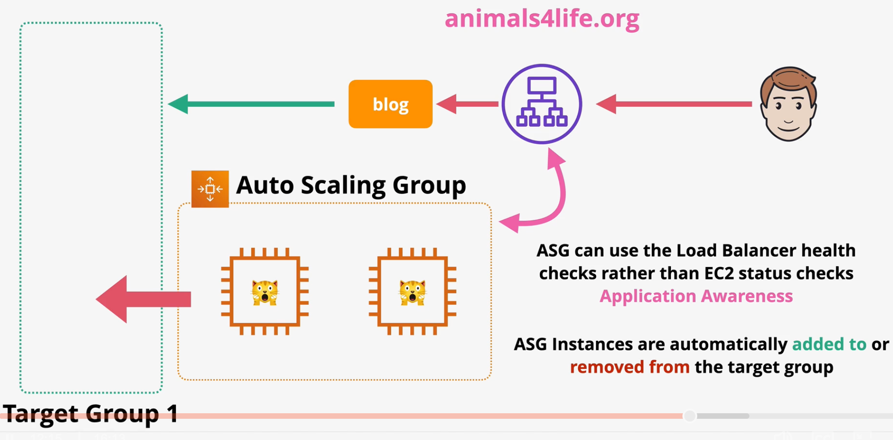
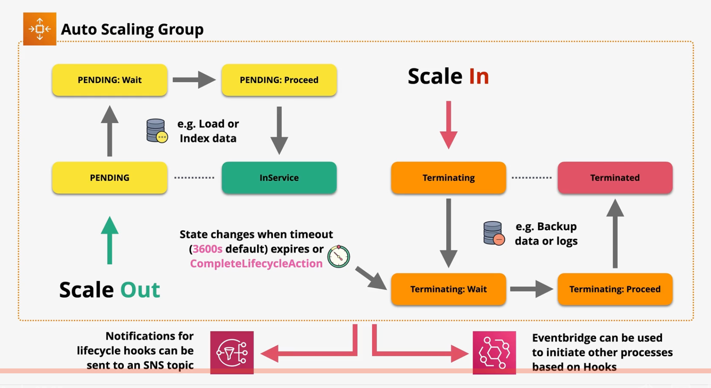

# Auto Scaling Groups

Auto Scaling Groups (ASGs) provide automatic scaling and self-healing for EC2 instances.

`Launch templates` are used to define scaling parameters including the `min`, `max`, and `desired` capacity.

When creating launch templates, you must specify the subnets in which the EC2 instances should be launched. The ASG will attempt to distribute the instances evenly across all available AZs.

`Scaling policies` can be automated based on metrics (e.g., CPU).

Scaling policies can be `manual`, `scheduled`, or `dynamic`. 

Dynamic scaling can be broken down into subtypes:
- `Simple` scaling: scale up/down based on a simple metric (e.g., CPUUtilization > 50%)
- `Stepped` scaling: Scale up/down in proportion to the metric value (e.g., +1 instance for every 10% above 50% CPUUtilization)
- `Target tracking` scaling: Defining a target for a metric and allows ASG to add/remove instances to maintain that target value (e.g., Desired Aggregated CPU = 40%)

ASG supports EC2 `health checks` and `self-healing`. The ASG service periodically checks the health of all instances in the ASG. If an instance is reported as unhealthy, it is terminated and a new instance takes its place.

ASGs can integrate with ELB load balancers. When an ASG adds (removes) an instance to (from) the group, it will automatically be added (removed) to (from) the target group of the load balancer. 

When integrated with an ELB, the ASG can use the load balancer health check instead of the default EC2 instance check.

Scaling processes in an ASG can be `SUSPENDED` or `RESUMED`.

If the `Launch` action is set to the `SUSPENDED` status, the ASG will not create new instances. When the `Terminate` action is set to the `SUSPENDED` status, the ASG will not terminate existing instances.

| Load Balancer Features | |
| --- | --- |
| AddToLoadBalancer | Adds new instances to the load balancer target group on launch. |
| AZRebalance | Balances instances evenly across all available AZs. |
| AlarmNotification | Accepts notifications from CloudWatch alarms in order to intiate a scaling event. |
| HealthCheck | When enabled , performs health checks on instances. |
| ReplaceUnhealthy | When enabled, replaces unhealthy instances. |
| ScheduledActions | When enabled, initiates scaling events based on a schedule. |
| Standby | Instances can be placed in `STANDBY` mode in order to prevent any scaling events. This feature is useful when performing maintenance on a server. |

There is no cost for using autoscaling groups.

## Lifecycle Hooks

Lifecycle hooks allow you to define custom actions during instance launch or termination transitions.

When enabled, instances will pause within the launch or termination flow for one of two events:
- Timeout: Once the specified timeout is reached, the instance will either `CONTINUE` to launch (terminate) or `ABANDON` the action.
- The `CompleteLifecycleAction` action can be used to explicitly resume the ASG process.

Lifecycle hooks can in integrate with EventBridge, SNS, and SQS.

