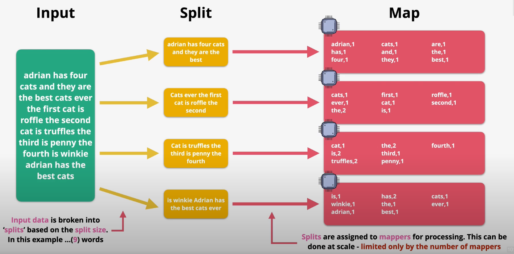
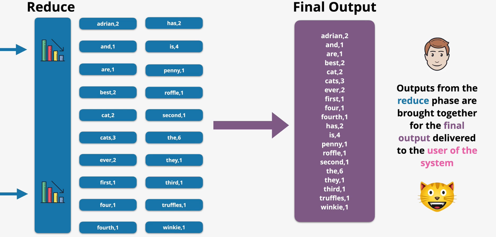
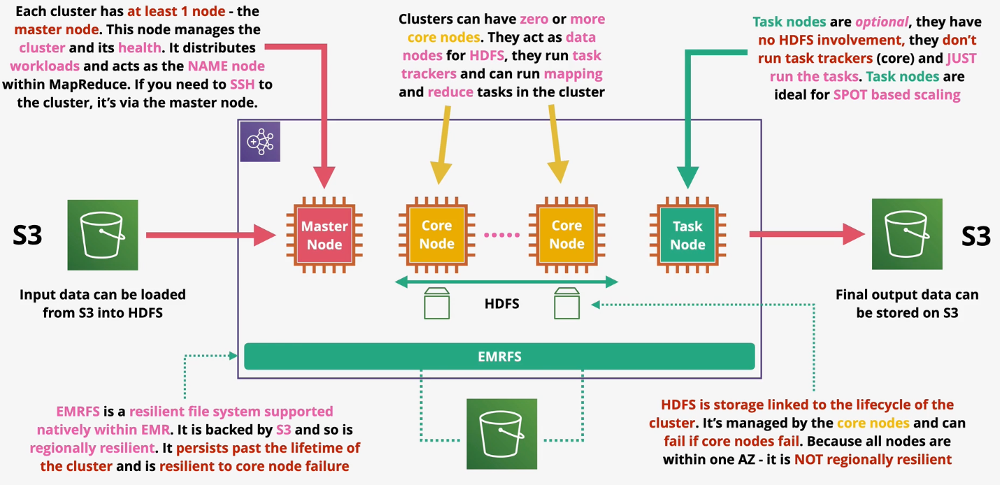

# MapReduce

Apache MapReduce is a high scale data analysis architecture that relies on parallel processing.

MapReduce consists of two phases: `map` and `reduce`. It can also contain other phases, such as `combine` and `partition`.

The general flow of a MapReduce job is as follows:
1. Input data is received by the job.
2. Data is separated into `splits`. Each split is assigned to a `mapper`.
3. Operations are performed at on each split based on the requirements.
4. Optionally, other phases are applied to the data such as `shuffling` or `partitioning`.
5. Data is `combined` into results.
6. The combined data is `reduced` into a form that meets the requirements.

MapReduce uses the `Hadoop File System` (HDFS). Unlike traditional file systems which store data across multiple data notes, HDFS is highly fault tolerant since it replicates data between nodes.

In HDFS, the `name node` provides the *namespace* for the file system and controls access to HDFS.

A `block` is a segment of data on HDFS (generally 64 MB).

*Caption (below): Input data is fed into a MapReduce job. It is split based on the split size and mapped to nodes for processing.*

*Caption (below): The result of the mapper is shuffled so that results are consolidated.*

*Caption (below): The result of the shuffle phase is aggregated into a meaningful result.*

*Caption (below): The result of the reduce phase is transformed into some desired format and stored.*

# EMR

EMR is a managed implementation of Apache Hadoop. EMR also includes other components of the MapReduce ecosystem such as Spark, HBase, Presto, Flink, Hive, and Pig.

EMR can support long-running architectures, or transient one-use infrastructure. 

EMR uses EC2 for compute. EMR supports spot instances, instance fleets, reserved instances, or on-demand instances.

EMR auto scales automatically based on configuration.

EMR is used for big data processing, manipulation, analytics, indexing, transformation, data pipelining, and more.

EMR runs in a VPC within a single AZ so it is not highly available.

EMR runs within a cluster consisting of at least one node. The `master node` manages the cluster, distributes workloads, and acts as the `name node` within MapReduce. The master node supports SSH.

Clusters can have zero or more `core nodes`. Core nodes run critical tasks including running task trackers and acting as data nodes for HDFS. Core nodes can also run tasks.

Clusters can also have zero or more `task nodes`. Task nodes are only responsible for running tasks. They do not have any responsibility supporting critical tasks such as HDFS and task trackers and are therefore ideal for spot instances.

`EMRFS` is a resilient S3-backed file system supported natively within EMR. Unlike HDFS, it is regionally resilient. EMRFS automatically persists data past the lifetime of the cluster and is resilient to core node failures.

