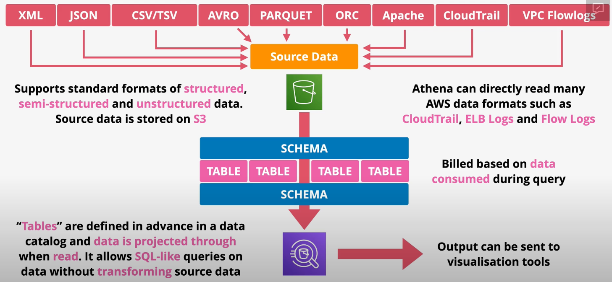

# Athena

Amazon Athena is an interactive query service that makes it easy to analyze data in Amazon S3 using standard SQL. Athena is serverless, so there is no infrastructure to manage, and you pay only for the queries that you run.

Athena uses `schema-on-read` technology, which means that your table definitions applied to your data in S3 when queries are being executed. There’s no data loading or transformation required. You can delete table definitions and schema without impacting the underlying data stored on Amazon S3.

Output can be pushed to other AWS services.

Athena supports standard formats of structured, semi-structured, and unstructured data in S3, as well as AWS-data formats like CloudTrail, ELB Logs, and VPC Flow Logs.

Tables are defined in advance in a data catalog and data is projected through when read.

**Use Cases**:
- Use Athena when you need to query data without loading or transforming it in advance.
- For occasional or ad-hoc queries of data in S3.
- Low-cost serverless querying of data in S3.
- Querying AWS logs (e.g., VPC Flow logs, CloudTrail, ELB)
- Querying data defined in the AWS Glue data catalog

The `Athena Federated Query` feature is an extension to the Athena query engine that supports non-S3 data. The non-S3 data is queried using Lambda functions.
