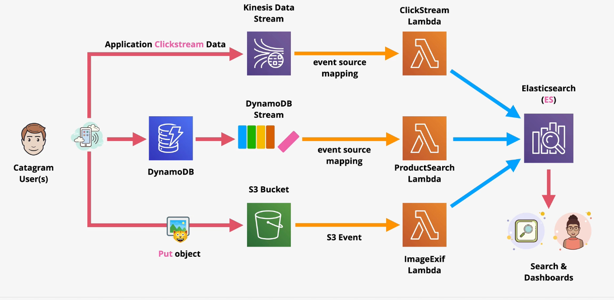

# Elasticsearch (ES)

Amazon Elasticsearch Service is a fully managed service that makes it easy for you to deploy, secure, and run Elasticsearch cost effectively at scale.

The service provides support for open source Elasticsearch APIs, managed Kibana, integration with Logstash and other AWS services, and built-in alerting and SQL querying.

Amazon Elasticsearch Service lets you pay only for what you use – there are no upfront costs or usage requirements.

Elasticsearch is not serverless; It runs in a VPC using provisioned compute.

Components of the ELK stack:
- `Elasticsearch` for searching and indexing text
- `Kibana` is a visualization and dashboarding tool
- `Logstash` is similar to CloudWatch Logs in that it can ingest logs into Elasticsearch. Logstash requires the Logstash agent.

