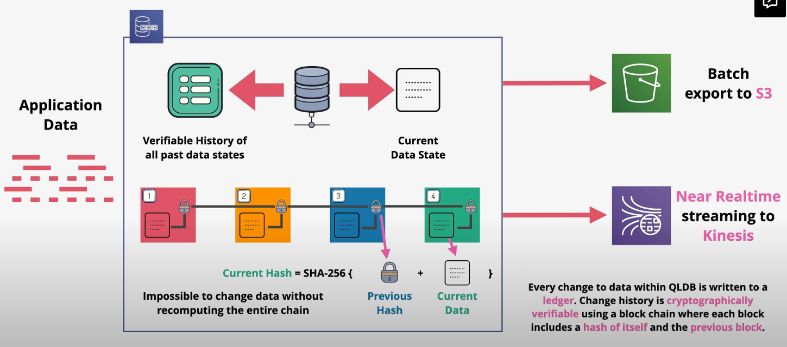

# QuantumDB

Amazon QLDB is a fully managed ledger database that provides a transparent, immutable, and cryptographically verifiable transaction log owned by a central trusted authority. 

Amazon QLDB can be used to track each and every application data change and maintains a complete and verifiable history of changes over time.

Amazon QLDB is serverless and 3-AZ resilient.

QLDB can stream data to Amazon Kinesis.

QLDB is an ACID-compliant database.

1. A hash is calculated from the data.
2. When the data is chained, the hash includes the changes plus the hash of the old version. As a result, it is impossible to chain data without recomputing the entire chain.

**Use Cases**:
- Finance applications in which account balances and transations must be immutable
- Medical applications to view the fully history of data changes
- Logistics application in which tracking movements of objects is important
- Legal applications in which usage and data change (e.g., custody) is important