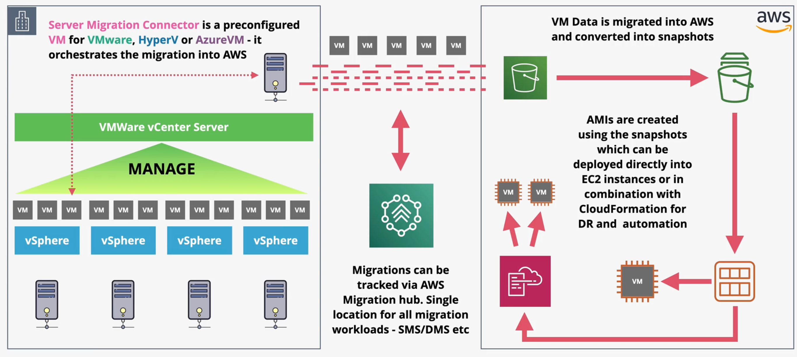
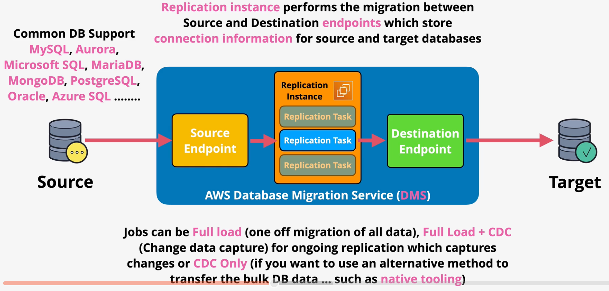

# Cloud Migration

There are several approaches an organization can take to migrate to the cloud.

Step 1: **Discover** - You must be aware of all of the components that will need to be migrated.

Step 2: **Assess** - Given a catalog, you must assess which strategy will be used. Different applications may require different strategies.

Step 3: **Prioritize** - You must determine the order in which technology will be migrated.

When assessing options, organizations should consider the 6 "Rs" of cloud migration:

| Strategy | Description | Benefits | Drawbacks | E.g., |
| --- | --- | --- | --- | --- |
| Rehosting | Lift and Shift | Reduced admin overhead, optimization becomes easier once in AWS, potential cost savings | Not taking full advantage of the cloud, potentially delaying the inevitable | Moving an application from an on-prem server to EC2 |
| Replatforming | Similar to rehosting, but architecture is optimized | Marginal improvements | No world-changing benefits | Use RDS instead of self-managed DBs, using ELBs instead of load balancers, S3 as backup |
| Repurchasing | Move the business function to a service provider | No longer need to manage a legacy application | Potentially costly | MS Exchange => Office 365, CRM => Salesforce |
| Refactor | Adopting a cloud-native architectures and products | Best long-term benefits for organizations | Expensive, time consuming | Service-oriented, micro-services, serverless, event-driven architectures |
| Retire | Decommission any apps that are no longer needed | Simplify tech stack | Only feasible for unneeded apps | Removing an app that is not really needed. |
| Retain | In some cases, the migration to cloud is not feasible and not worth the complexity or cost of the move. | No work to do | No benefits | Complex applications, super-important applications |

# Application Discovery Service

The `Application Discovery Service` allows you to discover your on-prem infrastructure, including which VMs exist, their memory and CPU settings, and other information.

ADS can run in two modes:
- `Agentless` mode using the `Application Discovery Agentless Connector`, which is an OVA-based application that integrates with VMWare to discover data about VM inventory and VM usage from *outside* the VMs. In agentless mode, ADS is capable of measuring performance and resource usage.
- `Agent-based` mode requires an agent to be installed, but discovers much deeper datasets such as networking, processes, usage, and performance, as well as dependencies between serveres.

ADS integrates with the `AWS Migration Hub` and Amazon `Athena`. Athena can be used to run ad-hoc queries on the discovered data.

# Server Migration Service (SMS)

The `Server Migration Service` (SMS) is a service that performs the migration of whole VMs, including OS, data, and apps). The VM is migrated as-is.

SMS is an agentless tool by using a `connector` that is deployed on-prem. 

SMS integrates with `VMWare`, `Hyper-V`, and `AzureVM` only.

SMS does incremental replication of live volumes meaning no downtime is required to migrate the VM.

SMS can also orchestrate multi-server migrations.

The tool creates AMIs which are used to create EC2 instances.

SMS integrates with `AWS Migration Hub`.

# Database Migration Service (DMS)

DMS is a managed database service in which `replication tasks` run on `replication instances` on EC2.

DMS connects to the `source` database via a `source endpoint`, which contains all configuration required to connect to the data store.

DMS will write data to the `destination` database via the `destination endpoint`.

Either the source or destination endpoint must be on AWS.

The source database remains fully operational during the migration, minimizing downtime to applications that rely on that database.

DMS supports the most common database engines, including MySQL, Aurora, Microsoft SQL, MariaDB, MongoDB, PostgreSQL, Oracle, Azure SQL, and more.

DMS migrations are defined in terms of `jobs`. Jobs can be one of three types: full load, full load + CDC, or CDC only.

During a `full load` migration, DMS will perform a one-off migration of all data. During a `full load + CDC` migration, DMS will perform a full migration of the data and migrate changes from the CDC logs. During a `CDC only` migration, DMS only performs ongoing CDC migrations.

The `Schema Conversion Tool` (SCT) can assign with schema conversion during data migrations. SCT is used when converting from one database engine to another, including from a database to S3. SCT is not used when migration between databases of the same engines.

SCT works with OLTP database types (e.g., MySQL, MSSQL, Oracle) and OLAP (e.g., Teradata, oracle, Vertica).

SCT does not migration any data. Instead, it migrates the schema from one engine to another.

DMS can integrate with the Snowball family of services.
1. Use SCT to extract data locally and move to a snowball device.
2. Ship the device back to AWS, which is loaded into an S3 bucket.
3. DMS migrations from S3 into the target data store.
4. CDC can capture changes