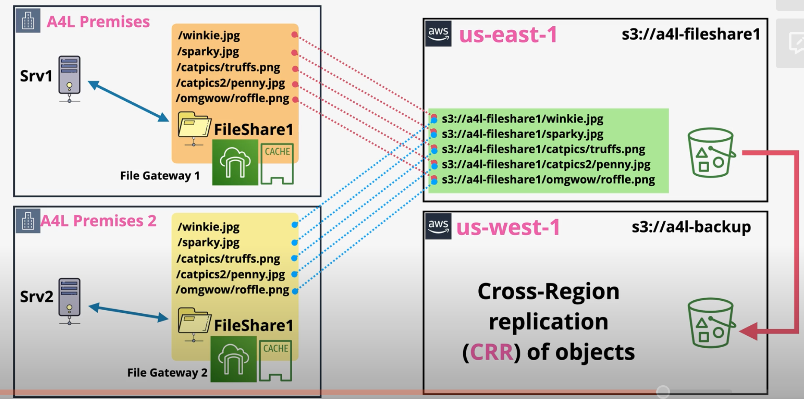

# Storage Gateway

Storage Gateway is a family of services that can be used to assist in cloud migrations, extending on-prem storage into the cloud, storage tiering, disaster recovery, and replacement of backup systems.

A Storage Gateway is typically run on an on-prem VM, but can also be run as a hardware appliance.

Storage gateway presents storage using `iSCSI`, `NFS` (Linux environments), or `SMB` (Windows environments) and writes data to EBS, S3, and Glacier within AWS.

Storage Gateway is made up of three types of gateways:
- [Storage Gateway - Volume Gateway](#volume-stored)
- [Storage Gateway - Tape Gateway](#tape-gateway)
- [Storage Gateway - File Gateway](#file-gateway)

## Volume Stored

On-prem servers typically use the `iSCSI` protocol for network block storage on a `Network Attached Storage` (NAS) device.

A `Volume Gateway` can be used to replace on-prem NAS/SAM devices. Volume gateway presents NAS/SAM compliant devices to be used by on-prem servers, exactly the same way they would for on-prem NAS servers.

Storage gateway (volume) runs in two modes:
- [Stored Mode](#stored-mode)
- cached mode

### Stored Mode

In stored mode, all data is stored locally. All data written locally is also written to the `upload buffer`. Once on the upload buffer, the data is asynchronously copied as `EBS snapshots` into S3 via the public `Storage Gateway Endpoint`.

Storage gateway volume stored mode should be used for:
- Full disk backups of servers
- Assist with disaster recovery by creating EBS volumes from the EBS snapshots

**Stored mode does not improve database capacity.** All data is stored locally!

### Cached Mode

Volume gateway `cached mode` shares the same basic architecture as stored mode, but the primary location of the data is no longer on-prem. Instead, all data is stored in an AWS-managed part of `S3` (cannot be viewed from the console).

The only data that is stored locally (`cached`) is the frequently accessed data.

Cached mode can be used for `data-center extension`, in which all data is stored in S3, but accessed as if it were on-prem.

### Stored vs Cached Mode

Stored and Cached mode of a Volume Gateway share some similarities.
- In both modes, a Storage Gateway is deployed on-prem as a VM or hardware appliance. The Gateway is a iSCSI device that provides `raw block storage` over a network.
- In both modes, an `upload buffer` is used to temporarily hold day until it is `asynchronously` copied to S3.
- In both modes, the data is copied via the public Storage Gateway `endpoint`.
- In both modes, data is stored as an `EBS snapshot`. New EBS volumes can be created from the snapshots in the event of a disaster.

Storage and Cached mode differ in other ways:

| Stored Mode | Cached Mode |
| --- | --- |
| All data is stored locally. Data is backed up to the cloud. | All data is stored in S3. Only frequently accessed data is cached locally. |
| Data is stored in a customer-managed S3 bucket. | Data is stored in an AWS-managed S3 bucket. |
| Does not increase the capacity of a data center. | Increases the capacity of a data center. |
|  All data is accessed quickly since it is stored locally. | Only cached data is accessed quickly. |

## Tape Gateway

Tape Gateway is also known as `VTL` (Virtual Tape Library). 

Organizations typically backup data periodically. Backups can be used to restore functionality or data in the event of a disaster or security incident.

There are several ways to accomplish this, but one way is to backup to tape (e.g., LTO-9). Organizations write to tapes offsite.

Tapes are inserted into a `tape drive` to be read from or written to. Many drives are stored in a `tape library` or a `tape shelf`. `Tape loaders` are robot arms used to swap tapes into and out of drives.

Servers communicate with the tape drive using `iSCSI`.

A `VTL Gateway` is used to act as a tape backup device using `iSCSI` to accept backups, write them to S3, and archive them into Glacier.

Backup data is written and read using the public `storage gateway endpoint`.

Backup data is initially written to S3, which acts an AWS-hosted tape library (i.e.,VTL). Each virtual tape can be anywhere from 100 GiB to 5 TiB.

Tapes are archived into the tape shelf (VTS) within Glacier. When archived backups are required, they are restored to the VTL.

VTL enables consumers to gain benefits from cloud storage, but still be compatible with their existing tape backup infrastructure and processes.

## File Gateway

In `file mode`, Storage Gateway bridges on-prem file storage and S3. 

Files are accessed via `mount points` (shares) via `EFS` (Linux) or `SMB` (Windows). Each mount point is associated with a single S3 bucket. The mount point association with an S3 bucket is called a `bucket share`. A single file gateway supports up to 10 bucket shares.

When files are written to the mount point, they are visibile as objects in the S3 bucket.

Storage Gateway in file mode supports `read caching` and `write caching` to ensure LAN-like performance.

S3 objects are given a name based on the directory within the file share.  

`/winkie.jpg` -> `s3://a4l-fileshare/winkie.jpg`  

*Caption (below): Diagram shows a simple example in which on-prem servers are backed up to S3.*

## Multiple Shares

Storage Gateway in file mode can also be used for sharing data between multiple on-prem sites.

By default, when data is written to S3 from one file gateway, the other file gateway is not notified. The other file gateway must perform a `listing` command to view the most recent data. 

The `NotifyWhenUploaded` API can be used to notify other gateways when objects are changed.

File Gateway does not support `object locking` to prevent write collisions. Instead, organizations must implement a read-only mode on other shares or tightly control file access.

*Caption (below): This architecture shows multiple on-prem contributors to the same file gateway.*

File Gateway can be partnered with S3 replication to ensure backups to another region for Disaster Recovery (DR).

To make file storage more cost effective, use lifecycle rules to transition data through different storage classes.

