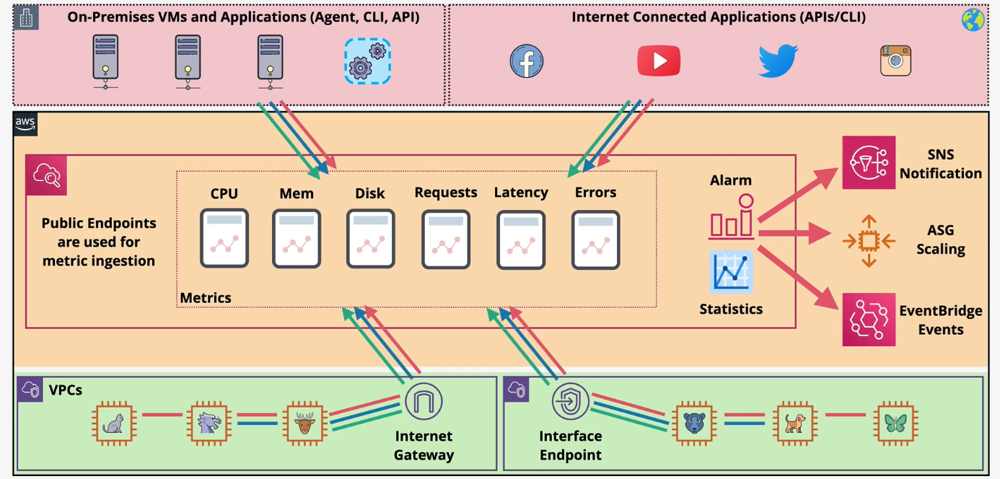
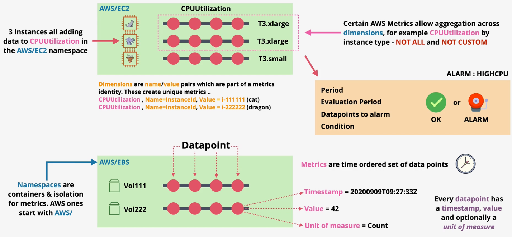

# CloudWatch

## Metrics

CloudWatch ingests, stores, and manages metrics. CloudWatch is a public service that can be accessed via the public space endpoints.

CloudWatch integrates with many AWS services. Some services, such as EC2, require a CloudWatch agent to be installed on the instance to publish metrics.

CloudWatch metrics can be integrated with on-prem servers and custom applications via the CloudWatch agent and API.

CloudWatch metrics can trigger `alarms` that monitor and react to metrics. Alarms can be used to notify or perform configured actions.

A CloudWatch `namespace` is a container for metrics (e.g., AWS/EC2, AWS/Lambda).
A CloudWatch `metric` is a specific type of measurement within a namespace (e.g., *CPUUtilization in AWS/EC2*).
A CloudWatch `dimension` is a name-value pair that form part of the unique identifier for a metric. For instance, many EC2 metrics publish `InstanceId` as a dimension name, and the action instance ID as the value for that dimension (e.g., *`Name=InstanceId, Value=i-11111111`*).
    - CloudWatch automatically adds some dimensions in order to apply aggregations to metrics (e.g., `AutoScalingGroupName`, `ImageId`, `InstanceId`, `InstanceType`).
A CloudWatch `datapoint` is an instance of a measurement of a metric. Datapoints consist of a timestamp, value, and unit of measure (e.g., 42% CPUUtilization).

When metrics are published into CloudWatch, they are published according to a `resolution`. By default, metrics are published according to the `standard` resolution (every 60 seconds). Optionally, and for a cost, users can choose to enable `high` resolution which publishes metrics every 1 second.

CloudWatch metrics are retained based on these rules:
- Metrics collected once per hour are retained for 455 days.
- Metrics collected once every five minutes are retained for 63 days.
- Metrics collected once per minute are retained for 15 days.
- Metrics collected more than once per second are retained for 3 hours.

As data ages, it is aggregated and stored for longer with less resolution according to the schedule above.

CloudWatch `statistics` is an aggregation over a period (e.g., min, max, sum, average).

CloudWatch `percentiles` is a calculation that show the distribution of your metrics (e.g., p95 shows the 95th percentile of your data).

## Alarms

CloudWatch `Alarms` monitor a metric over a time period and trigger one or more actions if the metric passes some threshold.

CloudWatch Alarms can be in `OK` or `ALARM` status.

CloudWatch Alarms support resolutions of standard or high (10 seconds or 30 seconds). You can also set a regular alarm with a period of any multiple of 60 seconds.

## Logs

CloudWatch logs can store and organize log data from AWS, on-prem, and IOT servers or any custom application.

In order to publish logs to CloudWatch, the server must have the CloudWatch agent installed.

CloudWatch Logs is used to store VPC flow logs, CloudTrail logs, Elastic Beanstalk, ECS Container logs, API Gatway logs, Lambda execution logs, Route53 DNS request logs, and more.

A `log event` is a single logging statement sent by an application, server, or AWS service. Log events consist of a timestamp and raw message.

A `log stream` is a sequence of log events that share the same source (e.g., Lambda function). Each separate source of logs in CloudWatch Logs makes up a separate log stream.

A `log group` is a group of log streams that share the same configuration settings such as retention, permissions, and encryption are set on the log group.

A `metric filter` can apply a regex filter against a log stream to identify important events. A custom CloudWatch metric can be created from a metric filter. CloudWatch can then monitor and trigger actions on the metric using CloudWatch Alarms.

CloudWatch logs can be exported to S3 using the S3 export feature (i.e., `Create-Export-Task`). Exports of this type can take up to 12 hours to export and only support the SSE-S3 encryption mode.

CloudWatch Logs also support `log subscriptions`. Log subscriptions can be attached to a log group. Subscription filters stream log events to the configured destinations.
- *Kinesis Data Firehose* provides near-realtime delivery
- *AWS Lambda* can be used to write the log data to Amazon ElasticSearch in near-realtime.
- *AWS Lambda* can be used to process log data or export data to any destination in near-realtime.
- *Kinesis Data Stream* can be used to publish logs to any KCL consumers.

It is a best practice to aggregate logs across environments and applications to a single S3 bucket.