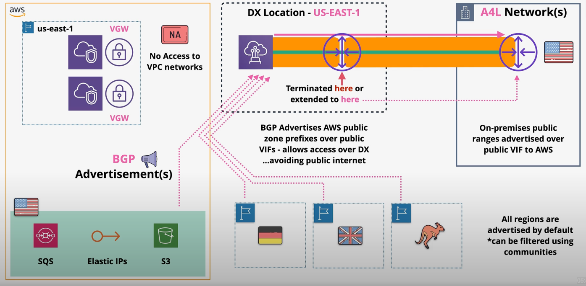
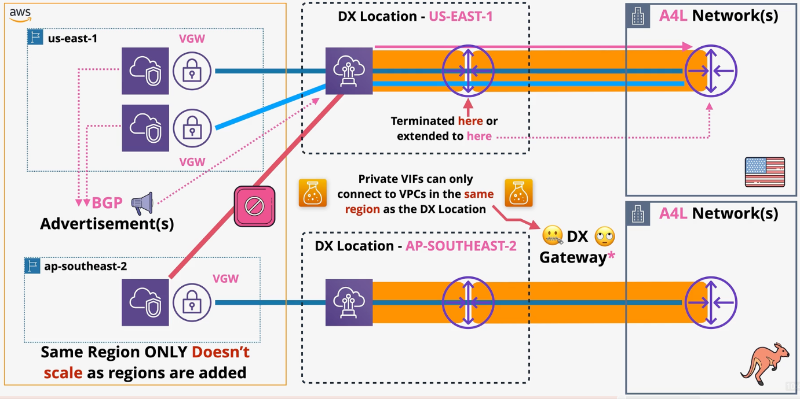
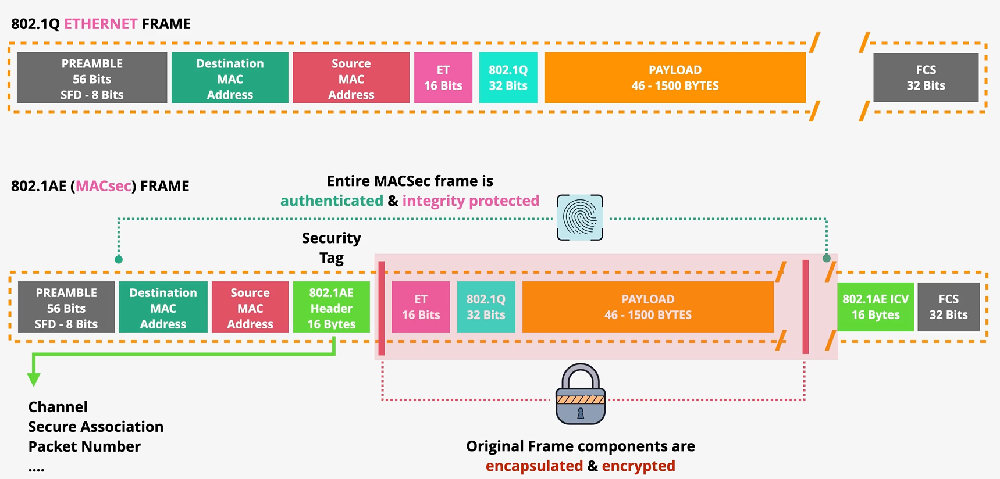
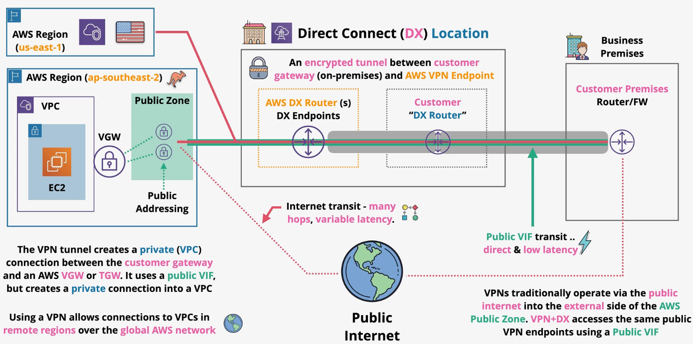
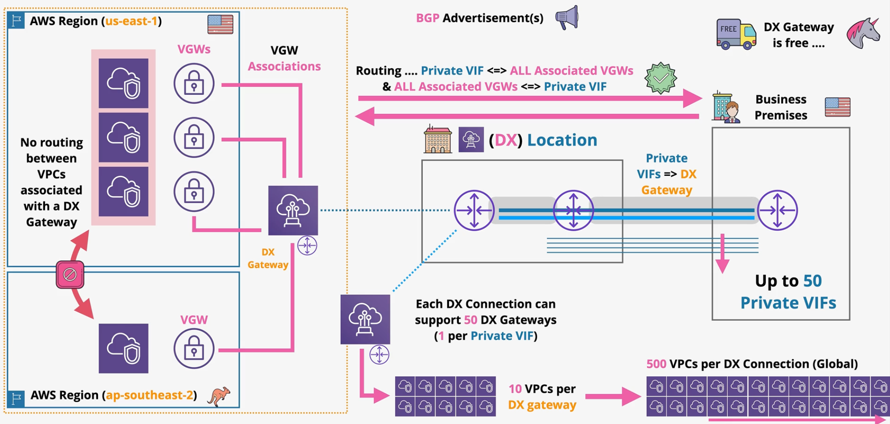
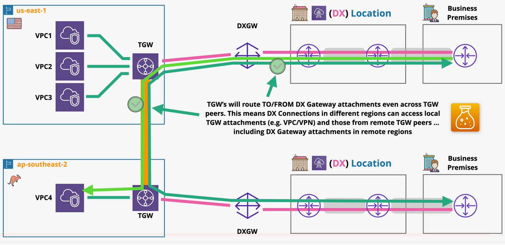
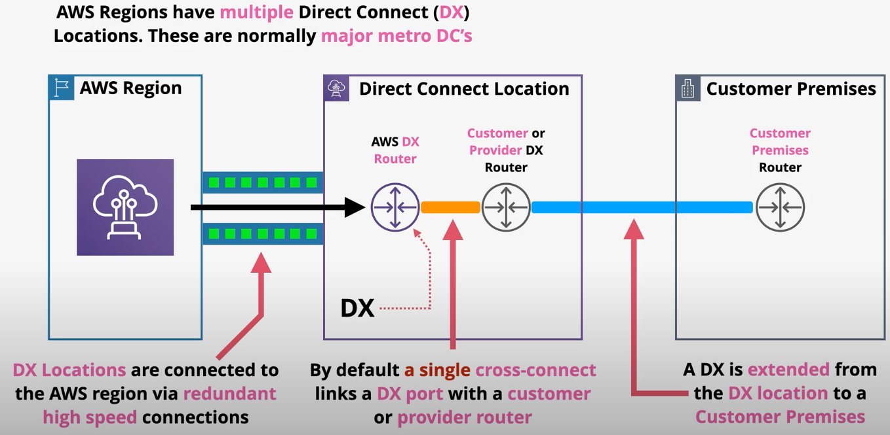
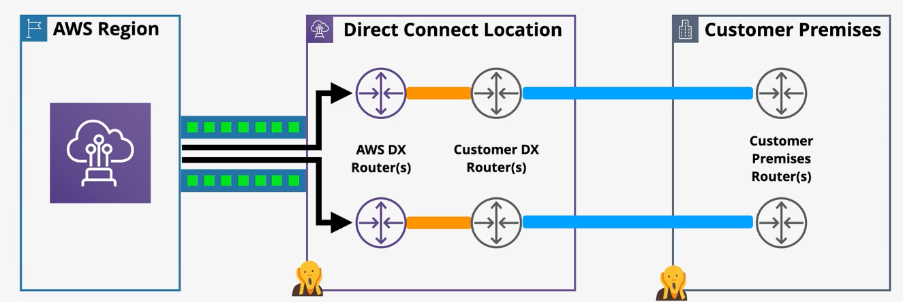
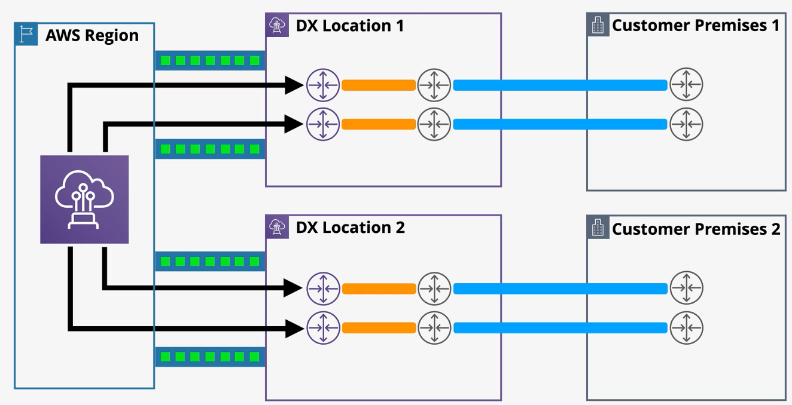

# Direct Connect

**Direct Connect (DX)** is a physical connection between a business premises, a DX location, and an AWS region.

DX allows for 1, 10, and 100 Gbps connections.

When you enable DX in AWS, you're simply reserving a port allocation at the DX location. It is the customers responsibility to physically connect to the DX location.

DX costs include hourly charges and outbound data transfer charges.

DX provides low and consistent latency. It also enables connection to AWS private services (VPCs) and AWS public services (e.g., S3, DynamoDB) without traversing the public internet.

DX locations are large regional data centers that are not owned by AWS, but rent space and equipment to AWS.

DX requires some specific configurations:
- auto-negotiation must be disabled
- port speed and full-duplex manually set
- Must support BGP and BGP MD5 authentication

Additionally, there are some cable requirements:
- 1 Gbps connection: 1000BASE-LX (1310 nm) transceiver
- 10 Gbps connection: 10GBASE-LR (1310 nm) transciever
- 100 Gbps connection: 100GBASE-LR4

## DX Connection Process

1. AWS customer lodges a DX request with AWS at some DX location.
2. AWS allocates a DX port on an AWS DX router at that DX location.
3. Customer downloads an LOA-CFA (Letter of Authorization - Customer Facility Access) form.
4. Customer lodges a request with the DX location data center owner to cross-connect the AWS and customer cages. The LOA-CFA form must be provided to the DX location owner.
5. DX location staff provision a cross-connect from AWS equipment to customer equipment.

> If you don't have space or equipment at a DX location, a comms partner can extend the DX port into your business premises.

## DX - BGP Session and VLANs

DX connections are layer 2 (data link) connections, but multiple types of layer 3 networks (e.g., VPCs, public zone) are required over a DX connection.

**VIFs (virtual interfaces)** allow multiple L3 networks to run over a L2 DX.

VLANs allow multiple isolated connections between the customer and AWS DX router.

VIFs consist of a:
- VLAN to isolate traffic
- BGP to exchange prefixes
- MD5 to authenticate BGP sessions

VIFs come in one of three types:
- [Public](#public-vifs)
- [Private](#private-vifs)
- Transit

Public VIFs are used to connect the public zone services.

A *dedicated* DX connection can have a total of 50 public and private VIFs, and one transit VIF.

A *hosted* DX connection can only have 1 VIF of any type.

### Public VIFs

Public VIFs are used to access AWS public zone services (e.g., Elastic IPs, S3, SNS, SQS). Private IP addresses cannot be accessed by public VIFs.

Public VIFs allow access to all public zone regions across the AWS global network (in contrast to private VIFs).

AWS advertises all AWS public IP ranges to the customer. The customer can advertise any public IPs owned over BGP. Advertised routes are not transitive; Customer-advertised prefixes do not leave AWS.

### Private VIFs

Private VIFs are created to access network resources within one AWS VPC via private IP addresses.

Private VIFs are attached to a *Virtual Private Gateway (VGW)* in the same region in which the DX location terminates.

Private VIFs can termninate at a VGW (default) or a *Direct Connect Gateway*.

There is no encryption on private VIFs, but apps can layer on encryption (e.g., HTTPS).

Private VIFs support standard (1500 MTU) or jumbo (9001 MTU) frames.

Route propagation is enabled by default in private VIFs when the VIF terminates at a VGW. AWS will advertise the VPC CIDR and the BGP Peer IPs and you can advertise specific corporate prefixes (100 max) or the default route (0.0.0.0/0).

> [Exam tip]   
>
> Private VIFs only support 100 advertised routes.

Key Learning Objectives:
- Private VIFs are used to access private AWS services (e.g., EC2) in VPCs via private IP addresses (NOT public IPs).  
- Private VIF => 1 VGW => 1 VPC  
- Private VIFs support IPv4 or IPv6.
- The customer configures an ASN on the VIF. The customer ASN can be publicly owned (granted by IANA) or private (64512 to 65535).
- An AWS ASN is configured on the VGW.

## DX Limitations
- DX uses physical cables so there is no inherent resilience based on a damage cable.
- DX only supports single-mode fibre (not copper wires).
- The time it takes AWS to allocate the port and the time it takes to physically connect your on-prem location to the DX location results in weeks to months of lead time.

## MACsec

By default, traffic flowing through a DX is unencrypted. Historically, the solution has been to run an end-to-end VPN over the DX connection, but speed suffers due to the heavy computational requirements of the VPN.

*Caption: There are some security problems with a DX connection without MACsec.*  
*1. Plaintext data is flowing over a physical cable between AWS and a customer cage in the data center.*  
*2. Its common to use a 3rd party provider to establish the connection between the customer cage in the DX location and the customer premisis - another unknown party that must be trusted.*

DX with MACsec provides the confidentiality, data integrity, data origin authenticity, and replay protection lacking in DX without MACsec.

**MACsec** is a standard that extends the ethernet standard, allowing frames to be encrypted.

In order to use MACsec, two devices must be connected by switches or routers on the same L2 network (called *layer 2 adjacency*).

MACsec is designed to allow for super high speeds (e.g., terabit networks).

Components of MACsec:
- *Secure Channel* - unidirectional channels that are used to send data back and forth.
- *Secure Channel Identifiers (SCI)* - identifier for each channel.
- *Secure Associations* - communication over each channel takes place on transient sessions. Each secure channel generally only has one secure associations at a time.
- MACsec uses the *MACsec Key Agreement* protocol for key generation, discovery, and authentication.
- MACsec uses a *cipher suite* to determine how data is encrypted.

MACsec adds two 16 byte tags to the standard *802.1Q* ethernet frame:
- MACsec tag
- Integrity Check Value (ICV)

The original frame components are encapsulated, encrypted, and integrity protected.

### MACsec vs VPN (IPSEC)

MACsec does not replace IPSEC over DX since it is not an end-to-end solution. 

| | MACsec | IPSEC |
| --- | --- | --- |
| Scope | MACsec provides protection for devices on the same L2 network (single hop). | IPSEC provides E2E protection. |
| Throughput | MACsec is very efficient and supports terabit-speed networks. | IPSEC requires cryptographic overhead which limits speed and throughput. |
| Support | Router must support MACsec standard. | Much wider vendor support since OpenVPN is ubiquitious. |
| OSI Layer | Layer 2 | Layer 3 |

## VPN over DX

A VPN provides end-to-end encryption and authentication over the public internet or a DX connection. When VPNs are run over DX, you get low and consistent latency. 

VPNs over DX use a public VIF and VGW/TGW public endpoints.

Customers may choose to use a VPN over DX, or a VPN as a backup to the DX connection, or both.

## Direct Connect Gateway

Problem statement: Thus far, a private VIF over a DX connection terminates at a VGW. This type of connection only allows access to private AWS services within the same region as the DX connection.

**Direct Connect Gateway** is a global device that is accessible from every region. Instead of terminating at a VGW, a DX connection can terminate at a DX Gateway to provide access to multiple VPCs across many regions.

The DX Gateway is attached to one or more VGWs that are attached to VPCs. This allows traffic to flow from on-premise to these VPCs and vice versa. 

A DX gateway does not support VPC to VPC traffic.

DX Gateway has no additional costs.

Limitations:
- 1 Private VIF => One DX Gateway => 10 VGW associations (VPCs)
- 50 Private VIFs => 50 DX Gateways => 500 VGW associations (VPCs)

## DX, Transit VIFs, & Transit Gateways

Problem statement: DX Gateways are great for establishing a connection to multiple VPCs in many regions. However, they do not natively support VPC to VPC traffic.

Refresher: Transit Gateways (TGW) can be connected to multiple VPCs in the same region similar to a hub and spoke. The TGW allows many VPCs to communicate with each other. TGWs cannot be associated with VPCs in other regions, but two TGWs in different regions can be peered to share routes - effectively allowing communication between VPCs in one region with VPCs in other regions.

A **transit VIF** over a DX connection can terminate at a transit gateway (TGW). Since TGWs support transitive communication between VPCs and other peered TGWs in other regions, this setup effectively allows you to connect the on-prem business location with multiple VPCs in many regions.

Limitations:
- A DX gateway only supports on transit VIF.
- A DX gateway can use a transit VIF or private VIFs, but not both.
- A transit VIF can support up to 3 TGWs.
- DX Gateway does not support routing between interfaces attached to the gateway (e.g., two on-prem sites).

*Caption:*  
*- This example shows two on-prem business locations using a transit VIF over a DX connection from each location.*  
*- The DX connection terminates at an in-region TGW. The two regional TGWs are peered to allow for VPC to VPC communication.*  
*- This setup allows both business locations to communicate with VPCs in both AWS regions as well as communicate with each other.*

## DX Resilience and High Availability

### Default - NOT RESILIENT

- DX locations are connected to the AWS region via redundant high speed connections. This can be assumed to be resilient.
- By default, a single cross-connect links a DX port with a customer router.
- A DX is extended from the DX location to a customer premises.

What could go wrong?
- The entire DX location could fail
- The AWS DX router could fail
- The customer DX router could fail
- The cross-connect could fail
- The connection between the DX location and the customer premises could fail
- The customer premises could fail
- The customer premises router could fail

DX is not resilient by default, but it can be improved with careful planning.

### Better - SOMEWHAT RESILIENT

The following diagram shows a semi-resilient architecture. By establishing two DX connections using two customer premises routers, two customer DX routers, and two AWS DX routers, we have eliminated many of the single points of failure in the default pattern.

There are still several points of failure to consider:
- The DX location could fail
- The customer premises could fail
- If the two DX extensions to the customer premises are run using the same cable, it is still a single point of failure

### Even Better - RESILIENT

By establishing a DX connection at two different customer premises to different DX locations, the single points of failure in the previous architecture are remediated.

A failure in one location would result in a partial outage, but the company would still have a connection to AWS.

### Best - EXTREME RESILIENCE

By duplicating the DX connections in each customer premises, extreme resilience is possible.

## DX Link Aggregation Groups (LAG)

*LAGs* allow multiple physical connections to act as a single connection. By combining multiple connections, you can multiple the amount of speed available.

Each LAG supports a maximum of four connections of the same speed and that terminate at the same location. 

By having two 100 Gbps connections in a LAG, the speed of the connection is increased to 200 Gbps.

> [Exam Tip]  
>  
> Although LAGs do offer some resiliency benefits, it is primary advertised as a way to improve speed over a connection.  
> For the exam, assume LAGs do not improve resilience.

A LAG has a `minimumLinks` attribute that acts a measure of health for the connection. The LAG is active as long as there are (*minimumLinks*) number of active connections.