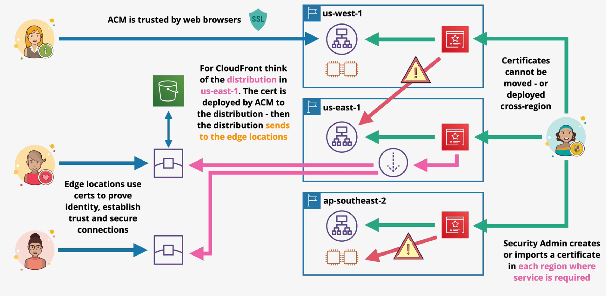

# ACM

AWS Certification Manager (ACM) enables the efficient creation, management, and deployment of public and private certificates in AWS.

ACM is capable of generating or importing certificates. For generated certificates, ACM will `automatically renew` certificates before expiry.

ACM can automatically deploy certificates for supported services such as CloudFront and ALBs. **EC2 is not a supported deployment service.**

ACM is a regional service. Certificates cannot leave the region in which they were generated or imported (i.e., an ALB within *us-east-1* must use an ACM certificate from *us-east-1*). Global services, such as CloudFront, operate from the *us-east-1* region.

