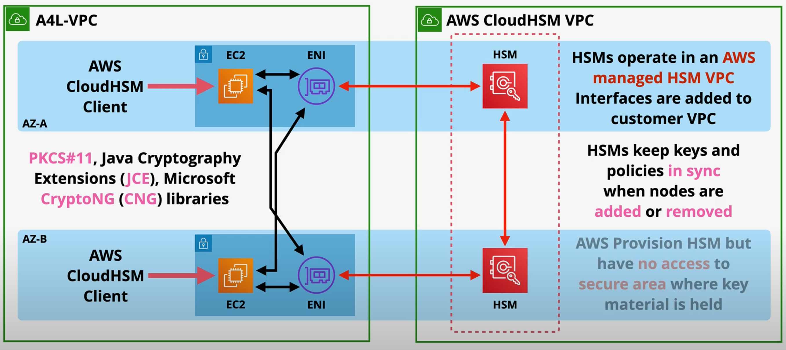

# Cloud HSM

CloudHSM is a FIPS 140-2 Level 3 compliant industry-standard single tenant appliance that is used to generate, store, and manage cryptographic keys.

AWS provision the HSM appliance but have no accessed to it. 

Organizations can interact with HSM via industry standard APIs:
- PKCS#11
- Java Cryptography Extensions (JCE)
- Microsoft CryptoNG (CNG) Libraries

KMS can integrate with a CloudHSM appliance as a `custom key store`.

CloudHSM appliances are deployed into an AWS-managed CloudHSM VPC, not a customer VPC.

In order to have high availability, customers must provision a CloudHSM `cluster` in at least two AZs. An ENI is injected into the customer VPC for every HSM module. When deployed as a cluster, the CloudHSM service will keep keys and policies in sync between the nodes.

> [Exam Tip]
>
> - CloudHSM is FIPS 140-2 Level 3 compliant
> - KMS is FIPS 140-2 Level 2 compliance (some parts are level 3)

**Use Cases**:
- CloudHSM does not support native integration with AWS services (e.g., S3 SSE).
- Use CloudHSM to offload SSL/TLS processing for web servers
- Enable TDE for Oracle databases
- Protect the private keys for an issuing certificate authority
