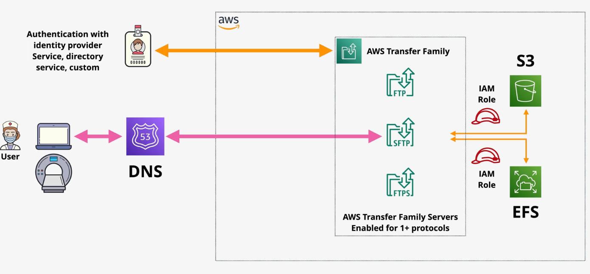

# AWS Transfer Family

AWS Transfer Family is a managed file transfer service that supports file transfer TO and FROM S3 and EFS. Transfer Family provides managed servers that support several file transfer protocols:
- File Transfer Protocol (FTP) - Unencrypted file transfer
- File Transfer Protocol Secure (FTPS) - File transfer with TLS encryption
- Secure Shell (SSH) File Transfer Protocol (SFTP) - File transfer over SSH
- Applicability Statement 2 (AS2) - Structured B2B data

AWS Transfer Family supports identities from directory services, custom authentication via Lambda and API Gateway, or the use of a service-managed directory.

Transfer Family supports `Managed File Transfer Workflows` (MFTW). MFTWs are serverless file workflow engines that can perform operations upon upload (e.g., tagging, notifications).

AWS Transfer Family uses IAM roles to access S3 or EFS.

AWS Transfer Family can be deployed in or outside a VPC:

**Public**: Public endpoints are used to access the Transfer Family server.
- Only supports SFTP
- Dynamic IP that can change
- Accessed over DNS
- Cannot control access via IP lists

**VPC - Internet**: Endpoint that is only accessible from a static public IP on network.
- Supports SFTP, FTPS, AS2
- Accessible by static IP from any client that is on-network
- Can be secured using security groups and NACLs

**VPC - Internal**: Endpoint that is only accessible from a static private IP on network.
- Supports SFTP, FTP, FTPS, AS2
- Accessible by static IP from any client that is on-network
- Can be secured using security groups and NACLs

Notables:
- AWS Transfer Family is multi-AZ and therefore resilient and scalable.
- Users are charged by hour for the provisioned server and for data transferred.
- The FTP and FTPS protocols only support directory service or a custom IDP.
- FTP (not secure) can only be deployed in *VPC-Internal* mode.
- AS2 can only be deployed within a VPC (internet/internal) mode.
