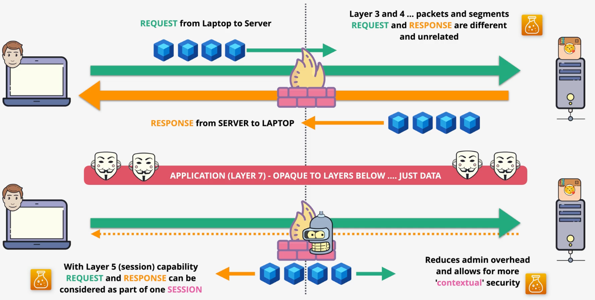
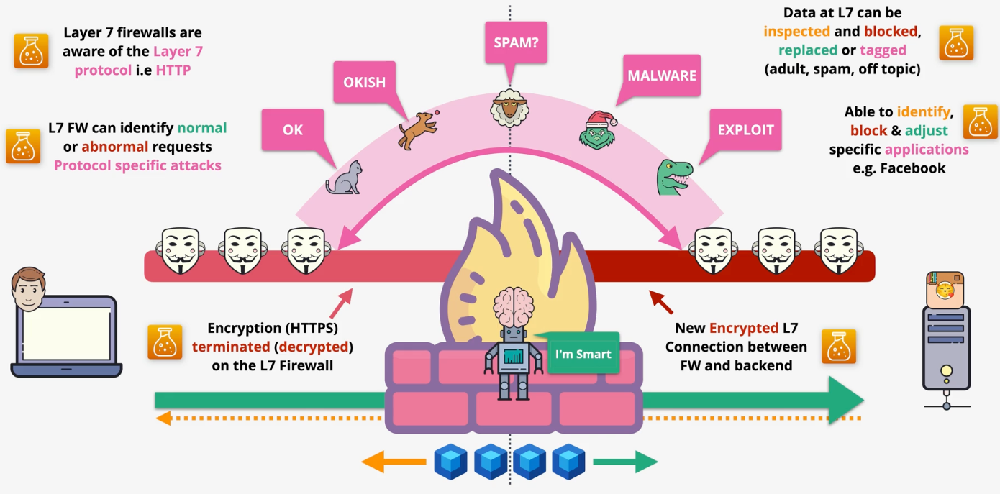
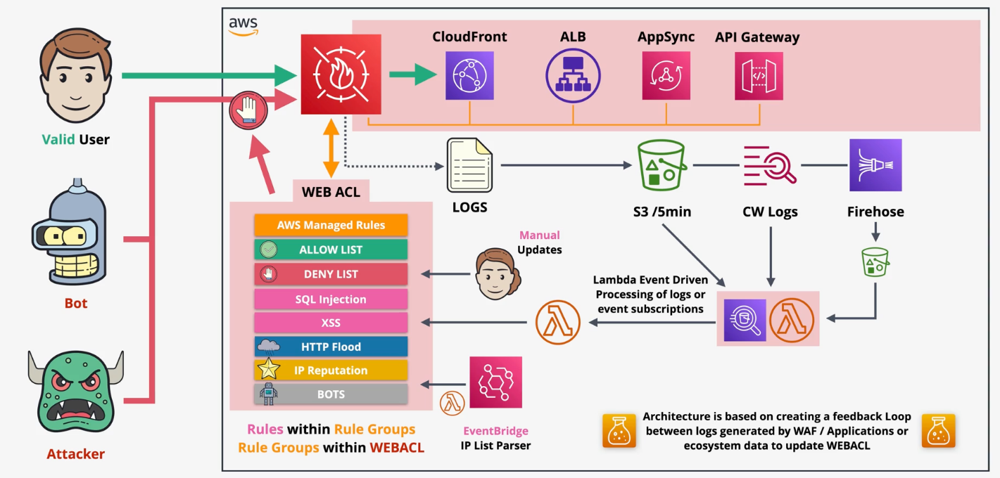
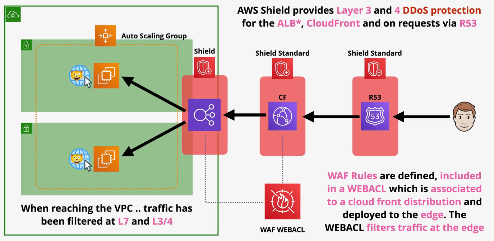

# Application Firewalls

Layer 3 (network) and layer 4 (transport) firewalls treat the request and response as completely seperate entities.

Layer 5 (session) firewalls see a request and response as part of the same session. This reduces admin overhead and provides more contextual security information.

Layer 7 firewalls are HTTP/S aware and are therefore able to support HTTP/S features such as header inspection.

When traffic passes through a layer 7 firewall, the SSL connection is terminated and a new one is established to the backend destination. This allows the firewall to inspect the traffic unencrypted.

Layer 7 firewalls can identify normal or abnormal requests.

# AWS Shield

AWS Shield provides AWS resources with `DDoS` protection.

AWS Shield has two service levels:
- Shield Standard
- Shield Advanced

| Shield Standard | Shield Advanced |
| --- | --- |
| L3/L4 DDoS Protection | L3/L4 DDoS Protection |
| CloudFront and Route53 only | EC2, ELB, CloudFront, Global Accelerator, and Route53 |
| Free of charge to all AWS customers | Cost |
| No access to DDoS response team | Access to DDoS response team 24/7 |
| No financial insurance | Financial insurance to reimburse customer for cost incurred during attack |

# WAF

WAF is a `layer 7` (http/s) firewall to protect against complex layer 7 attacks and exploits such as SQL Injection, XXS, Geo Blocks, Rate Awareness, and more.

WAF is applied via a `Web Access Control List` (WEBACL) integrated with ALB, API Gateway, AppSync, CloudFront, or an Amazon Cognito user pool.

Web ACLs are regional when applied to an ALB, API Gateway, or AppSync.

`Rules` can be added to a web ACL to evaluate traffic in real time. Rules are evaluated in order. 

Rules are grouped together into `rule groups`. Groups can be `managed` (by AWS or marketplace), custom, or `service-owned`.

Rules consist of a type, statement, and action.

The `rule type` can either be *regular* or *rate-based*.

A `rule statement` defines what needs to match the request. Statements can evaluate the origin country, IP, label, headers, cookies, query paramters, URI path, query strings, body (**first 8192 bytes only**), or the http method.

A `rule action` will either `ALLOW` traffic, `BLOCK` traffic, `COUNT` traffic, or `CAPTCHA`.

Web ACLs can default to `ALLOW` or `BLOCK` actions.

A `rate-based rule` tracks the rate of requests for each originating IP address, and triggers the rule action on IPs with rates that go over a limit.

When an action is `COUNT` or `CAPTCHA`, WAF can add a custom resource as a header (`x-amzn-waf-`) or a `label`. Labels can be referenced later in the same WEBACL.

WAF charges a monthly fee per WEBACL, a monthly fee for each rule in the WEBACL, and a rate per request evaluated.

AWS WAF uses `web ACL capacity units` (WCU) to calculate and control the operating resources that are required to run your rules, rule groups, and web ACLs. AWS WAF enforces WCU limits when you configure your rule groups and web ACLs. WCUs don't affect how AWS WAF inspects web traffic.

*Caption (below): AWS Shield Standard protects Route53 and CloudFront by default from DDoS attacks. A WAF can be associated with CloudFront and the ALB before it reaches the customer infrastructure.*

