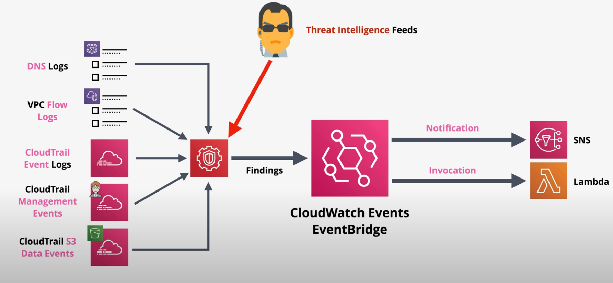

# Amazon GuardDuty

Amazon GuardDuty is a continous security monitoring service that uses AI/ML and threat intelligence feeds to analyze supported data sources in order to identify unexpected or unauthorized activity as it occurs.

When a `finding` is discovered, GuardDuty can be configured to notify via SNS or trigger an event-driven process via EventBridge. 

GuardDuty supports multiple accounts within an AWS Organization.

GuardDuty supports DNS logs, VPC Flow logs, CloudTrail logs.

