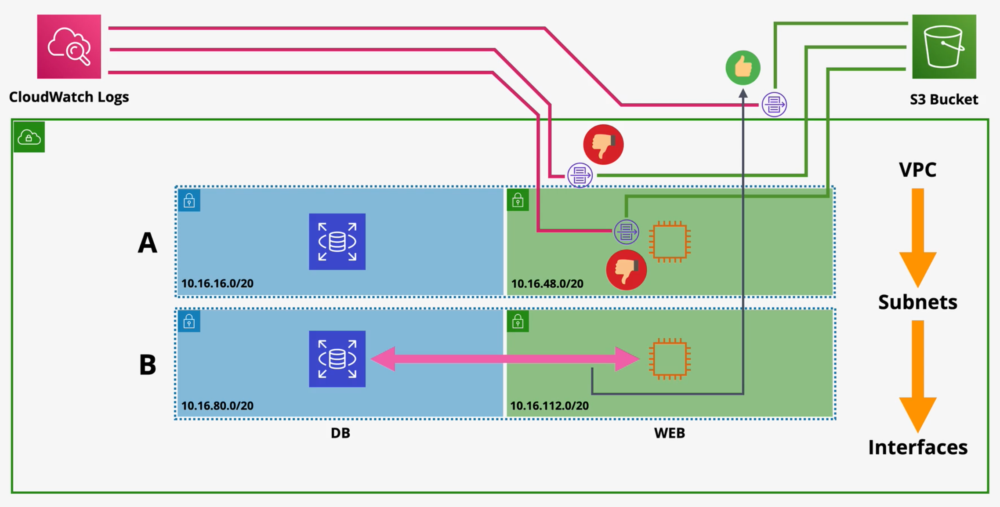

# VPC Flow Logs

VPC Flow logs capture `packet metadata` such as the source and destination IP addresses/port, packet size, and other externally-visible metadata. **Flow Logs does not capture packet contents.**

Flow logs are captured at specific monitoring points. Monitoring points can be provisioned at three different areas:
- `VPC` (monitors all interfaces in the VPC)
- `Subnets` (monitors all interfaces in the subnet)
- `Interface` (monitors traffic on that interface only)

VPC Flow Logs are not real time.

VPC Flow Logs can export data to S3 or CloudWatch Logs.

