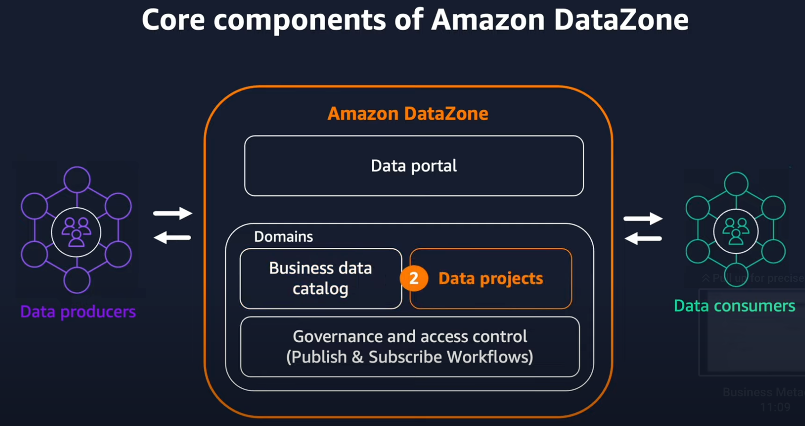
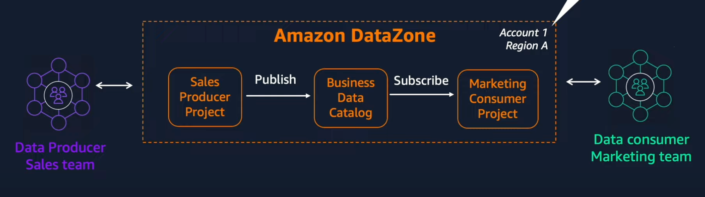

# Amazon DataZone

- [Overview](#overview)
- [Example Workflow](#example-workflow)
- [Resources](#resources)

## Overview

Amazon DataZone introduces several new components:
- *Business data catalog*: Makes metadata available with business context so anyone in the organization can find data.
- *Data projects*: Construct that enables you to define business use case-based groupings of people, data, and analytics tools. Projects provide users a space where members of the  projects are able to collaborateand share a common set of permissions to adata and tools.
- *Publish workflow*: Enables data producers to easily publish their data to the catalog.
- *Subscribe workflow*: Enables data consumers to subscribe to, or access, data that has been published to the catalog.
- *Governance and access control*: The publish and subscribe workflow have governance mechanisms to enforce access controls: Who is allowed to publish data to the catalog?, Who is responsible for ownership of the data? Who can subscribe to the data?
- *Data Portal*: A web-based UI in which DataZone users can experience all the capabilities of DataZone.

## Example Workflow

Consider the following example: *The marketing team needs access to sales data for a marketing project. With this data, the marketing team must run analytics for an upcoming promotion.*  

This organization will need to perform the following tasks in order to enable the marketing team:

1. Create DataZone Domain

    A domain is a collection of Amazon DataZone objects, such as assets, projects, associated AWS accounts, and data sources. Domains act as scalable containers in DataZone. Once the DataZone has been created, the DataZone portal will become available.

**PUBLISHING WORKFLOW** (Sales team)

2. Create *SalesProducerProject*

    The *SalesProducerProject* will be used to publish sales data to the DataZone catalog. This project will require a *project profile*--a set of preconfigured resources such as AWS account, region, VPC, and analytical capabilities for the selected domain.

    For convenience, Amazon provides a *Default Project Profile* with Athena and Glue Catalog capabilities that enable producers to publish data to S3.

    Creating a project in WorkZone will result in the creation of data-related resources, such as IAM roles, Athena workgroups, a dedicated S3 bucket, and Glue databases.

3. Create `catalog_sales` Glue table

    The project automatically created two Glue databases: `salesproducerproject_pub_db`--for publishing data and `salesproducerproject_sub_db`--for subscribing to data. The sales data producing team is responsible for creating Glue tables from the data in the publish database.

4. Publish `catalog_sales` table to DataZone

    Once the Glue table is available, it can be published through DataZone by using the *publishing* workflow. Once created, DataZone will run a job to copy all metadata from the Glue table into the DataZone project.

    The table can optionally be published in *draft mode* which gives the data owner the opportunity to enrich the catalog with business metadata. Once the data is properly enriched, it can be made active to publish to users.

**SUBSCRIPTION WORKFLOW** (Marketing team)

5. Create *MarketingConsumerProject*

    The marketing team will create a *MarketingConsumerProject* that will be used to subscribe to the sales data and other data published in DataZone for the marketing team.

6. Subscribe to `catalog_sales` table

    From within the *MarketingConsumerProject* project in the *DataZone* portal, a team member can subscribe to the *sales_catalog* table. Once approved, the marketing team will be granted access to the data.

7. Query the data using Athena.

    Finally, the marketing team can query the data from Athena through the DataZone portal.

## Resources

- [Amazon DataZone](https://aws.amazon.com/datazone/) 
- [YouTube - How to Get Started with Amazon DataZone](https://www.youtube.com/watch?v=9iAvHR1_CiA)
