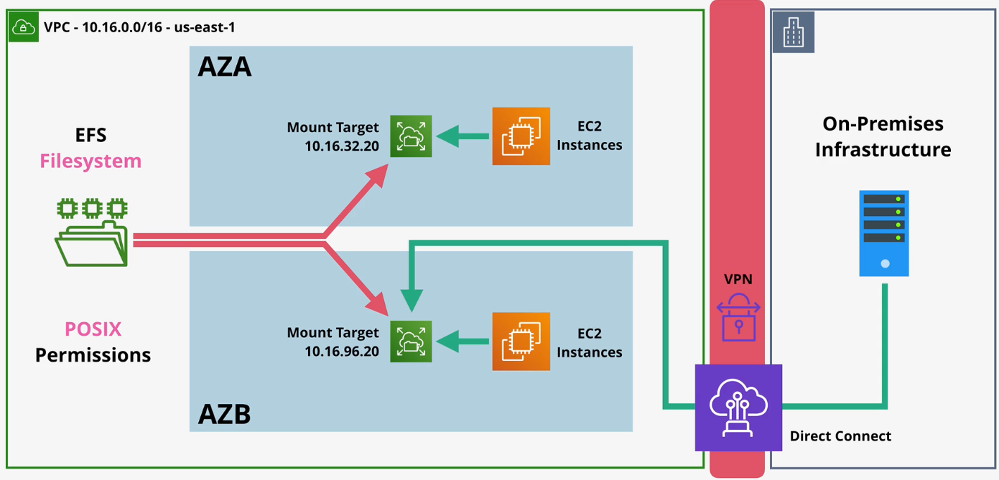
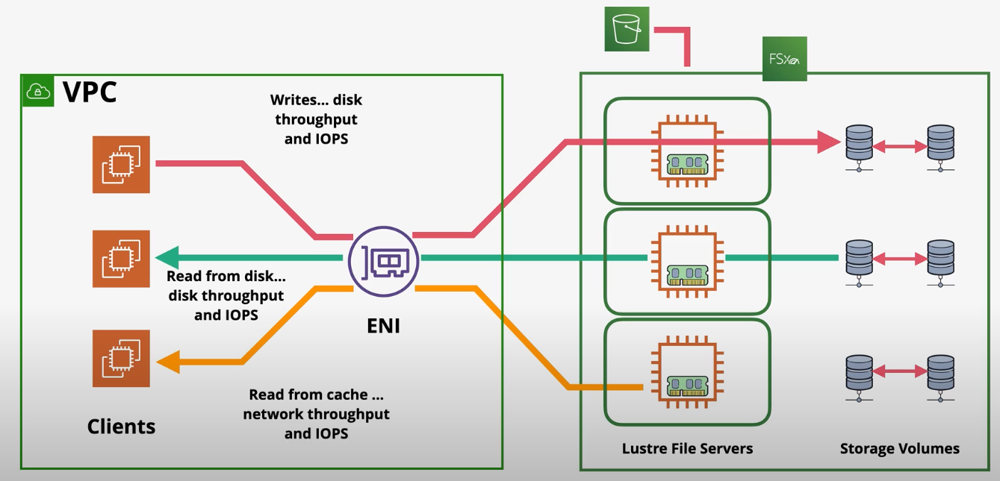
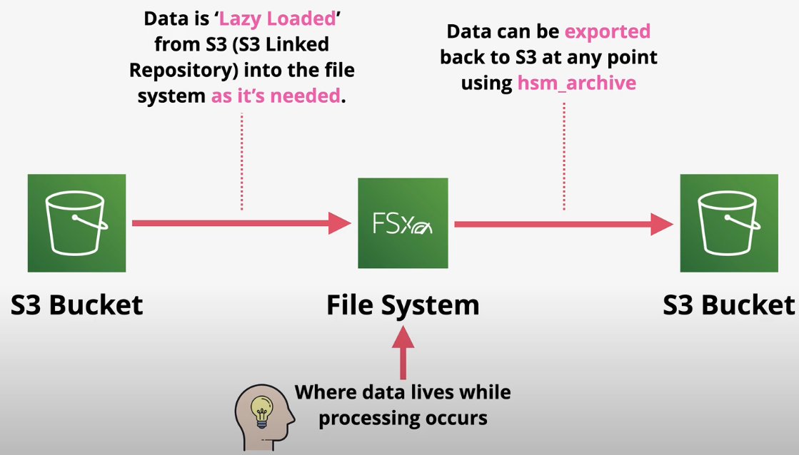

# EFS (Elastic File System)

`EFS` is a `NFSv4-based` file system that can be mounted into Linux. EFS uses `POSIX` file permissions.

A single EFS instance can be mounted into many EC2 instances at the same time.

EFS is a private service that is accessible from `mount targets` within a VPC. An EFS instance can also be accessed via VPN or DX as well.

To ensure high availability, a mount target should be deployed in multiple AZs.

EFS supports general purpose and max i/o `performance modes`. The general purpose mode is default and is sufficient for 99.9% of users.

EFS supports bursting and provisioned `throughput modes`.

EFS supports standard and infrequent access (IA) `storage classes`. Lifecycle policies can be used to automatically move data between storage classes.

*Caption (below): EFS is accessible from an on-prem network via mount targets over a VPN or DX connection.*

# FSx for Windows

`FSx for Windows File Server` is a fully-managed native Windows file server/shares. It is designed for integration with Windows environments.

FSx for Windows integrates with Directory Service or self-managed AD. This allows companies to integrate their existing on-prem AD with FSx.

FSx for Windows can be deployed in single or multi-AZ mode within a VPC.

FSx for Windows supports on-demand and scheduled backups.

FSx for Windows supports encryption at rest with KMS keys and can force encryption in transit.

FSx for Windows shares are accessible from within a VPC, a peered VPC, a VPN, or DX connection.

FSx for Windows key features and benefits:
- `VSS` (user-driven restores) allows users to restore files by interacting with the file share directly, rather than through AWS.
- FSx for Windows is a native file system accessible over `SMB` (in contrast to EFS which uses the NFS protocol).
- FSx for Windows uses the Windows permission model.
- FSx for Windows supports DFS (distributed file system) which allows scalable Windows shares.
- FSx for Windows is fully-managed and does not require a file server admin.

*Caption (below): FSx for Windows is a Windows file server.*

- *FSx for Windows can integrate with AWS services such as WorkSpaces.*
- *FSx for Windows supports integration with an AWS Directory Service or an existing on-prem AD.*

# FSx for Lustre

`FSx for Lustre` is a high-performing file system designed for Linux clients. Lustre supports `POSIX` style permissions.

Lustre offers 100s GB/s throughput and sub millisecond latency.

Lustre is used for machine learning, big data, and financial modelling.

There are type deployment types in Lustre - persistent or scratch.

`Scratch` is a deployment type that is highly optimized for fast access in the short term (no replication or data durability). Use scratch when you need pure performance, but do not need data durability or high availability.

`Persistent` is a deployment type designed for the longer team and considers requirements such as high availability, self-healing, and data durability. Data in a persistent deployment type is within one AZ only.

Both the scratch and persistent deployment types support manual or scheduled backups to S3.

FSx for Lustre is accessible over VPN or Direct Connect.

FSx stores file metadata into metadata targets (`MDTs`). 

Objects are stored on object storage targets (`OSTs`). By default, OSTs are 1.17 TiB each. By splitting the object stores into OSTs, Lustre can achieve high throughput.

The baseline performance of an instance is defined by its size:
- Minimum of 1.2TiB incremented by 2.4TiB.
- Scratch deployments baseline throughput at 200 MB/s per TiB of storage.
- Persistent deployments offers baseline throughput at 50 MB/s, 100 MB/s, and 200 MB/s per TiB of storage.
- FSx can burst up to 1,300 MB/s per TiB using a credit system.

### FSx for Lustre with an S3 Repository

*Caption (below): FSx for Lustre can be configured to use S3 as a repository.*

- *FSx can be configured to `lazy load` data from S3 into the file system as its needed. Data can also be exported back to S3 at any point using `hsm_archive`.*

## FSx for Windows vs FSx for Lustre vs EFS

| | FSx for Windows | FSx for Lustre | EFS | 
| --- | --- | --- | --- |
| Type | File Share | High-performance file share | File Share |
| Target OS | Windows | Linux | Linux |
| File Share Protocol | SMB | Lustre | NFS |
| Use case | Windows integration and permission model | HPC including machine learning | Linux integration with POSIX permission model |