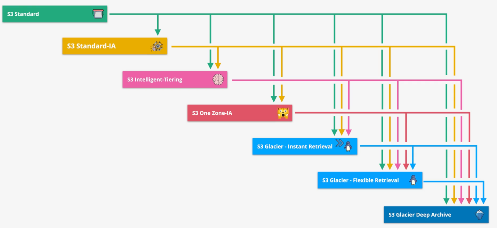

# S3

## Storage Classes

### S3 - Standard

The default storage class, `S3 - Standard`, replicates objects across at least three AZs in the same AWS region to achieve eleven 9s of durability. S3 uses `Content-MD5 Checksums` and `Cyclic Redundancy Checks` (CRCs) to detect and fix any data corruption. Customers are billed a storage fee, a transfer out fee, and a per-request fee.
- The storage fee is charged by GB
- The transfer fee is charged by GB
- The request fee is charged per 1,000 requests

S3 - Standard has a milliseconds first byte latency.

### S3 - Infrequent Access (IA)

`S3 - IA` shares a lot of the same characteristics as S3 - standard including the same durability and replication across at least three AZs.

S3-IA is billable by a storage fee, transfer fee, request fee, and a `retrieval fee`.
- The retrieval fee is charged per GB of data retrieved

Standard-IA has a `minimum duration charge` of 30 days. Objects can be stored for less time, but the minimum billing always applies.

Standard-IA has a `minimum capacity charge` of 128KB per object.

Standard-IA should be used for important long-lived data that is infrequently accessed.

### S3 - One Zone-IA

`S3 - One Zone-IA` shares most of the characteristics as S3-IA, but the data is not replicated across AZs. If the AZ fails, the data is gone.

S3 - One Zone-IA should be used for non-critical long-lived data that is infrequently accessed or data that can easily be replaced (e.g., cache data).

### S3 - Glacier Instant

`S3 - Glacier Instance` is similar to S3 Standard-IA, but has cheaper storage at the cost of a more expensive retrieval and longer billable minimums.

S3 - Glacier Instant has a `minimum duration charge` of 90 days and a `minimum capacity charge` of 128KB per object.

S3 - Glacier Instant should be used for long-lived data that is only accessed once per quarter in which retrieval times must be fast.

### S3 - Glacier Flexible

The `S3 - Glacier Flexible` was renamed from `S3 - Glacier`.

Objects stored in the S3 - Glacier Flexible storage class cannot be publicly accessible.

Objects in Glacier Flexible is retrieved to S3 Standard-IA temporarily in order to be accessed.

This storage classes offers flexible retrieval times that have different costs and SLAs:
- Expedited: 1-5 minutes
- Standard: 3-5 hours
- Bulk: 5-12 hours

The first byte latency for this storage class is minutes to hours.

This low cost storage class should be used for archival data where access is very infrequent (e.g., once per year) and minutes to hours of retrieval time is sufficient.

> To remember Glacier - Flexible, think of objects as being kept in `chilled storage`. These objects must be *thawed* before they become available.

### S3 - Glacier Deep Archive

`S3 - Glacier Deep Archive` is the most cost-effictive storage class at the cost of a high minimum duration and longer retrieval times.

Data in Glacier Deep Archive is retrieved to S3 Standard-IA temporarily for access.
- Standard: 12 hours
- Bulk: 48 hours

The first byte latency for this storage classes is hours to days!

Use this storage class for data that is rarely, if ever, accessed and an hours to days retrieval time is acceptable (e.g., legal or regulated data storage).

### S3 - Intelligent Tiering

`S3 - Intelligent Tiering` is not a storage class, but a storage class manager that can move objects between five different storage tiers:
- Frequent Access
- Infrequent Access
- Archive Instant Access
- Archive Access
- Deep Archive

Intelligent tiering monitors the usage of objects and automatically moves any objects not accessed for 30 days to a low cost infrequent access tier and eventually to archive instant access, archive access, and deep archive tiers.

The archive access and deep archive tiers are optional.

Intelligent Tiering has a monitoring and automation cost per 1,000 objects.

S3 Intelligent Tiering should be used for long-lived data with changing or unknown patterns.

### Comparing Storage Classes

| | Retrieval Time | Minimum Duration Charge | Minimum Capacity Charge | Durability | Replicated AZs | Use Case |
| --- | --- | --- | --- | --- | --- | --- |
| S3 - Standard | Instant | None | None | Eleven 9s | At least 3 AZs | Default | 
| S3 - Infrequent Access (IA) | Instant | 30 Days | 128KB per object | Eleven 9s | At least 3 AZs | Irreplacable data that is infrequently accessed. |
| S3 - One Zone IA | Instant | 30 Days | 128KB per object | Eleven 9s (assuming no AZ failure) | No replication - the data only exists in one AZ | Replaceable data that is infrequently accessed |
| S3 - Glacier Instant | Instant | 90 Days | 128KB per object | Eleven 9s | At least 3 AZs | Long-lived data that is accessed once per quarter in which instant retrieval is required |
| S3 - Glacier Flexible | Minutes to hours | 90 Days | 40KB per object | Eleven 9s | At least 3 AZs | Archived data that is very infrequently accessed (e.g., yearly) and minutes to hour retrieval time is sufficient. |
| S3 - Glacier Deep Archive | Hours to Days | 180 Days | 40 KB per object | Eleven 9s | At least 3 AZs | Archival data that is rarely, if ever, accessed in which hours to days retrieval time is acceptable. |

## S3 Lifecycle Configuration

A `lifecycle configuration` is a set of rules that consist of actions on a bucket or group of objects.

Lifecycle rules support `transition` actions and `expiration` actions.

Lifecycle transitions only flow "down". Transitions cannot be used to move an object to a higher storage tier.

*Caption (below): This chart shows the possible transitions of S3 object lifecycles.*

*Note how there are some restrictions on transitions:*
- *Transitions can only flow "down". Transitions cannot be used to move data to a higher storage class.*
- *S3-Intelligent Tiering cannot move data to S3-One Zone-IA.*
- *S3 One Zone-IA cannot move data to S3-Glacier Instance Retrieval.*

Exam Tips:
- There is a `minmum 30 day duration` before you can use a lifecycle rule to transition an object from S3-Standard to S3-Standard-IA or S3-OneZone-IA.
- Be aware that smaller objects can actually cost more when transitioned to S3-Standard-IA, S3-Intellint-Tiering, or S3-OneZone-IA due to the minimum billable size requirements (40KB per object)  of those storage classes.
- A single rule cannot transition to Standard-IA or OneZone-IA and THEN to Glacier classes within 30 days due to the duration requirement of the Standard-IA and OneZone-IA storage classes. To transition to Glacier classes before 30 days, use a separate rule.

## S3 Replication

There are two types of S3 replication:
- Cross Region Replication (CRR)
- Single Region Replication (SRR)

Replication requires an IAM role that will be assumed to perform the replication. The IAM role must allow S3 to assume it in the trust policy, allow read access to the source bucket, and write access to the destination bucket.

If data is being replicated across accounts, the destination bucket policy must explicitly allow write access to the replication IAM role..

Replication can be applied to the entire bucket or a subset of objects.

The default is to write the data to the same storage class as the source bucket, but replication can be configured to write to a lower storage class in the destination bucket.

By default, the object ownership will remain with the source account, but replication can be configured to set the owner to the destination account.

The `Replication Time Control` (RTC) feature can be applied to replication. This will guarantee that data will be replicated within 15 minutes.

Exam tips:
- Replication is `not retroactive`. When replication is enabled on a bucket, no existing objects will be replicated.
- Replication requires `bucket versioning` to be enabled.
- Replication is `one-way`. If you write an object to the destination bucket, it will not be replicated back to the source bucket.
- Replication supports unencrypted and server-side encrypted objects. If `SSE-KMS` is being used, extra configuration is required. Replication does not support `SSE-C`.
- Replication requires that the source bucket owner has permissions to the objects.
- Replication only supports user events. Replication does not support system events like lifecycle transitions. It also does not support replication of objects in the Glacier or Glacier Deep Archive storage classes.
- Replication does not support deletes.

S3 replication can be used for the following use cases:
- Log aggregation (SRR)
- Sync PROD and TEST (SRR)
- Data residency requirements (SRR)
- Global resiliency improvements (CRR)
- Reduce latency (CRR)

## S3 - Cross Account Access

There are three ways to grant access to S3 buckets across AWS accounts.
- [Bucket and Object ACLs](#bucket-and-object-acls)
- [Bucket Policies](#bucket-policies)
- [Assume Role](#assume-role)

### Bucket and Object ACLs

Bucket ACLs enable you to manage access to buckets and objects. Each bucket and object has an ACL attached to it as a subresource. It defines which AWS accounts or groups are granted access, and the type of access.

> Bucket ACLs are a legacy concept that is no longer recommended by AWS.

Bucket ACLs cannot be used to manage access within the same AWS account as the bucket.


Bucket ACLs grant access based on Cononical Account IDs (a legacy account identifier). The *Account canonical user ID* can be found on the *Security Credentials* console.

By adding a target account's canonical user id to a bucket or object's ACL, you can grant access to that account.

### Bucket Policies

A *bucket policy* is a resource-based policy that you can use to grant permissions to your bucket and the objects in it.

Bucket Policy permissions do not apply to objects owned by other AWS accounts.

```json
{
  "Version": "2012-10-17",
  "Statement": [
      {
          "Effect": "Allow",
          "Principal": {
              "AWS": "arn:aws:iam::1234567890:user/iamadmin"
          },
          "Action": [
              "s3:GetObject",
              "s3:PutObject",
              "s3:PutObjectAcl",
              "s3:ListBucket"
          ],
          "Resource": [
              "arn:aws:s3:::<bucket-name>/*",
              "arn:aws:s3:::<bucket-name>"
          ]
      }
  ]
}
```
*Caption: Bucket policy granting S3 access to the iamadmin user in the 1234567890 account.*

### Assume Role

S3 across-account access can also be setup using IAM roles.

Generally, cross account access using assume role looks like:

- The bucket exists in account A. 
- An IAM role exists in account A that has permissions to the S3 bucket. This IAM role grants trust permissions to another AWS account B.  
- An identity within B can assume the role and operate on the S3 bucket.  

The IAM role must grant `sts:AssumeRole` permissions to an identity in the other AWS account, or delegate access via the account root.

```json
{
    "Version": "2012-10-17",
    "Statement": [
        {
            "Effect": "Allow",
            "Principal": {
                "AWS": "arn:aws:iam::1234567890:root"
            },
            "Action": "sts:AssumeRole"
        }
    ]
}
```
*Caption: Trust policy that grants the `sts:AssumeRole` permissions to the 1234567890 account.*

### Object Ownership

When S3 ACLs are enabled, bucket owners can choose the preferred object ownership strategy.

.

- **Bucket owner preferred** - if new objects written to the bucket specify the bucket-owner-full-control canned ACL, they are owned by the bucket owner. Otherwise, they ware owned by the object writer.
- **Object writer** - The object writer remains the object owner.

If the assume role strategy is being used for object writers, then the objects will be owned by the bucket account.

### Policy Evaluation

All relevant policies are considered when evaluating access to a bucket or objects including:
- Organizational SCP
- Bucket Policy or ACLs
- IAM Permission Boundaries
- Session Policies
- Identity Policies

Given an *effective policy* (the product of all relevant policy statements), access evaluation will follow these steps:

| Step # | Condition | Result if condition satisfied |
| --- | --- | --- |
| 1 | Check for explicit deny | DENY |
| 2 | Check for explicit allow | ALLOW |
| 3 | Implicit Deny | DENY |

When the request is coming from another AWS account, an explicit ALLOW is required from the bucket account *and* from the other AWS account.

